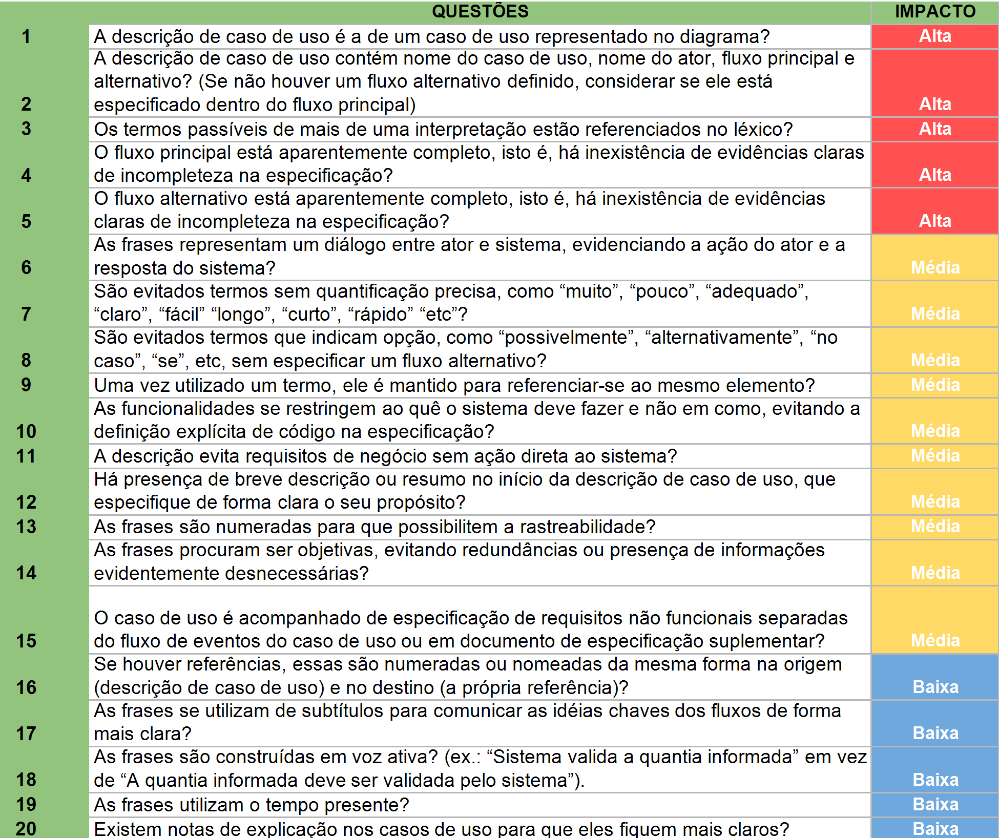
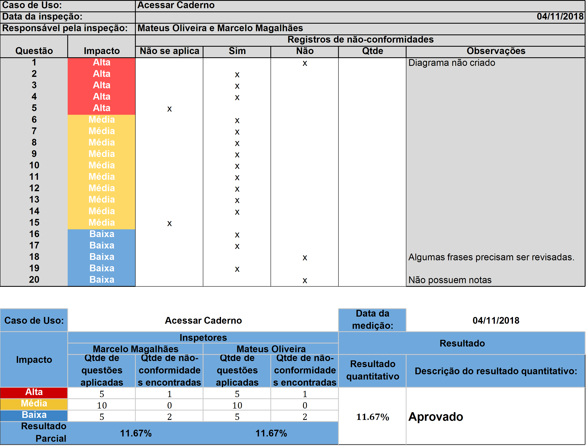
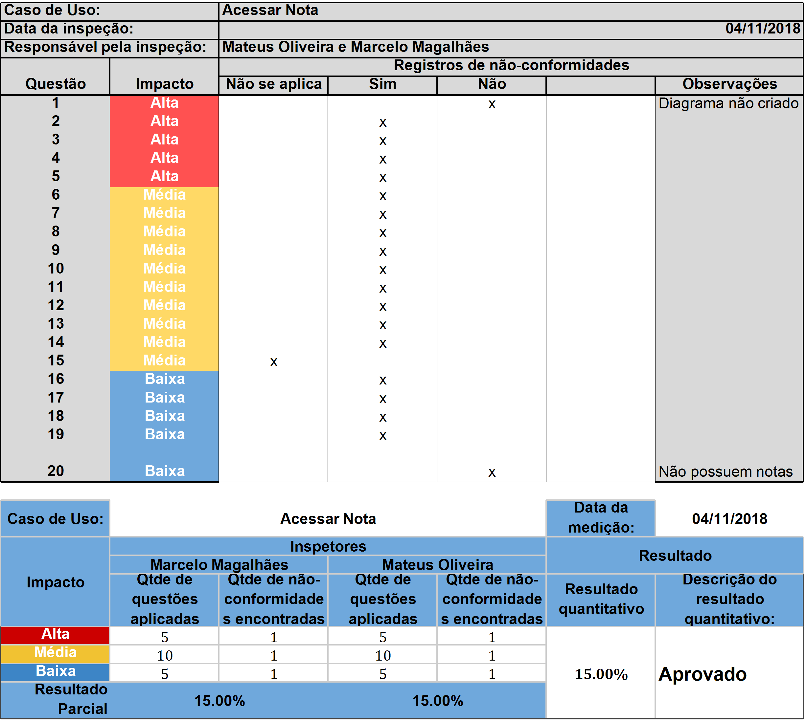
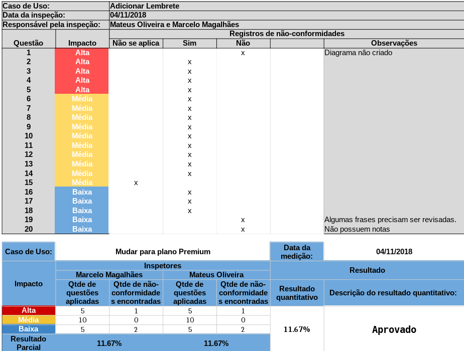
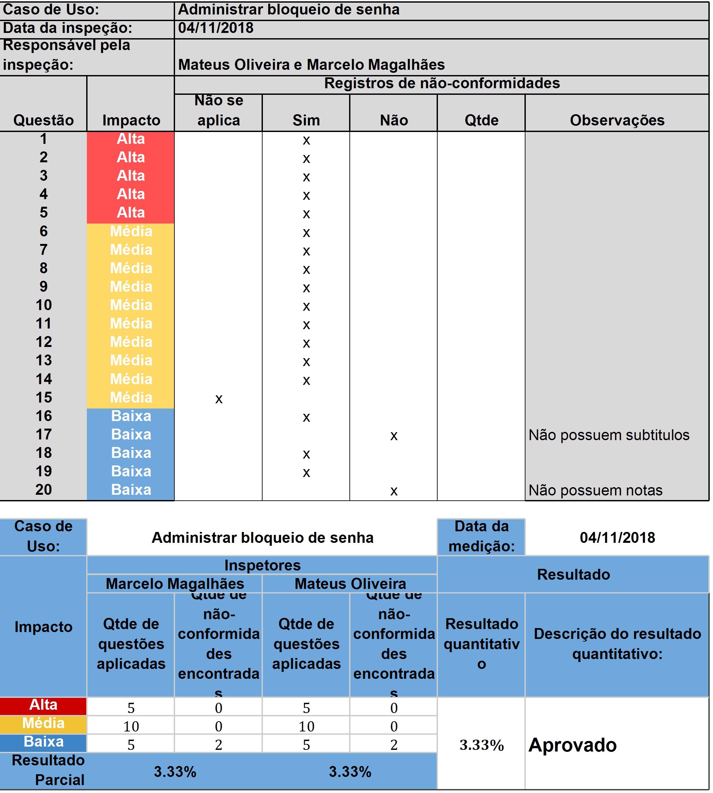
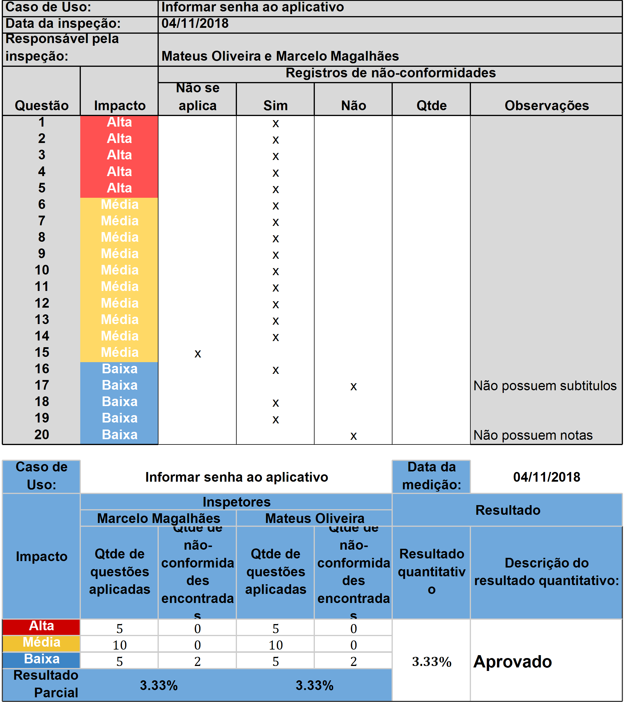
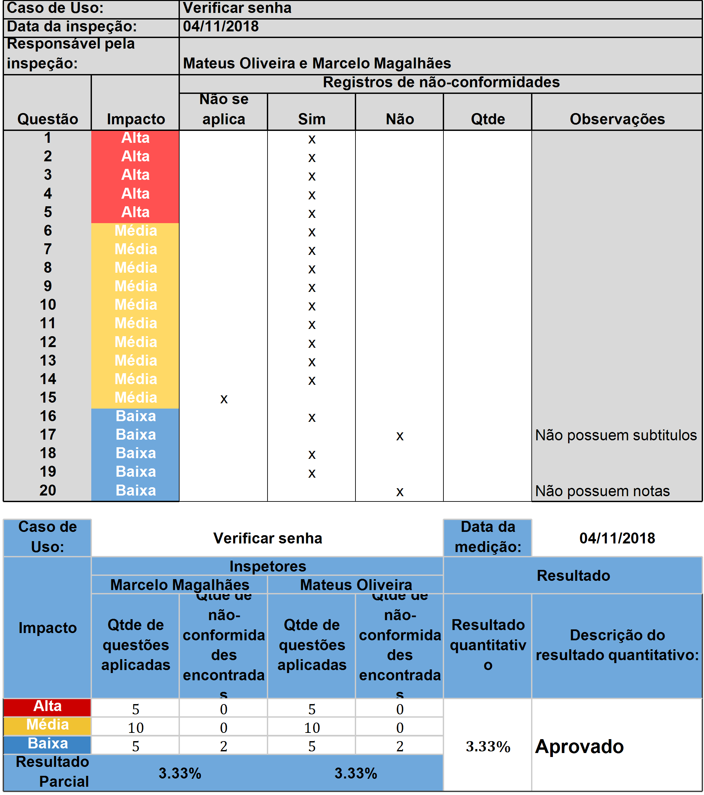
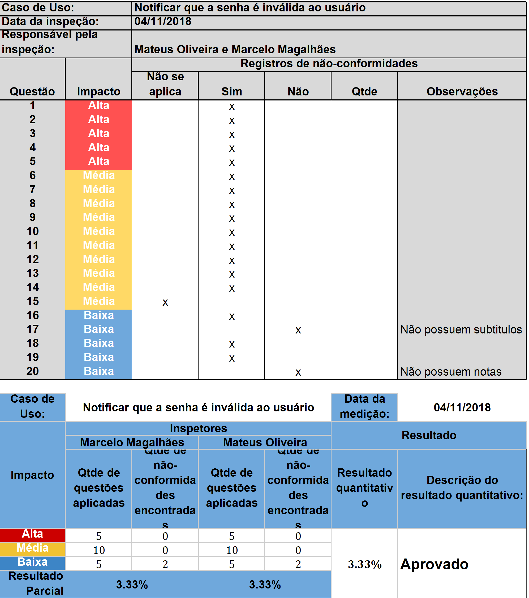
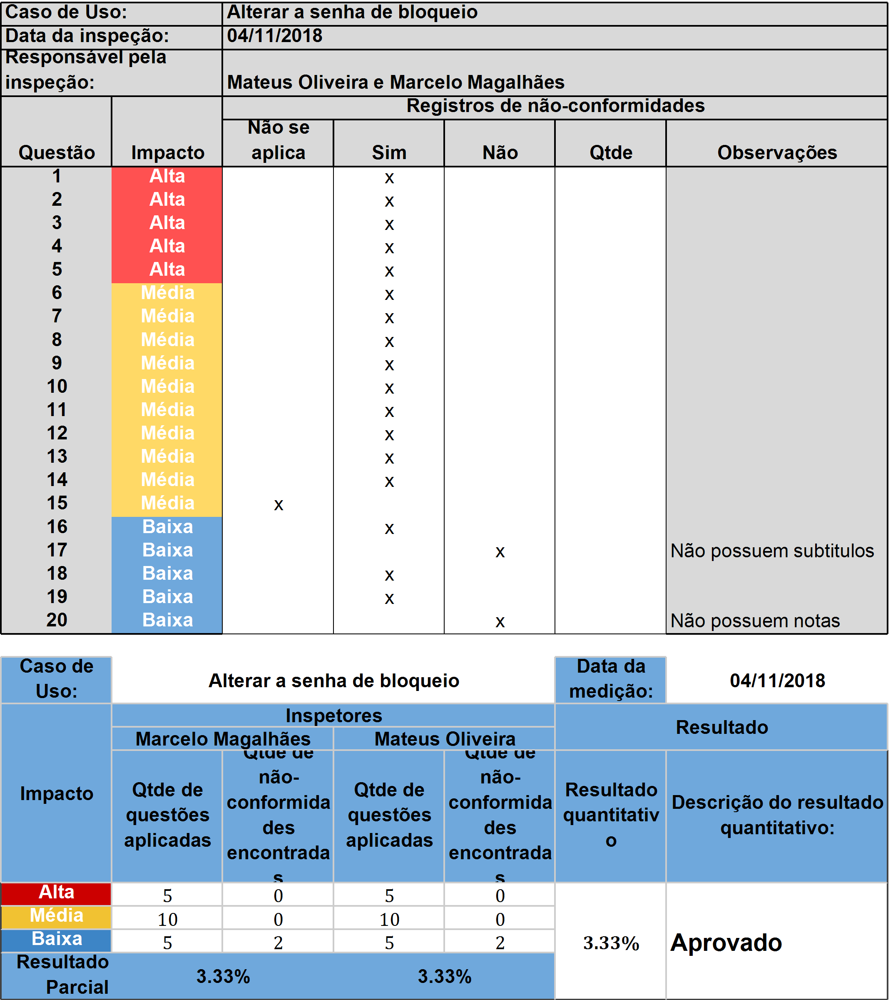
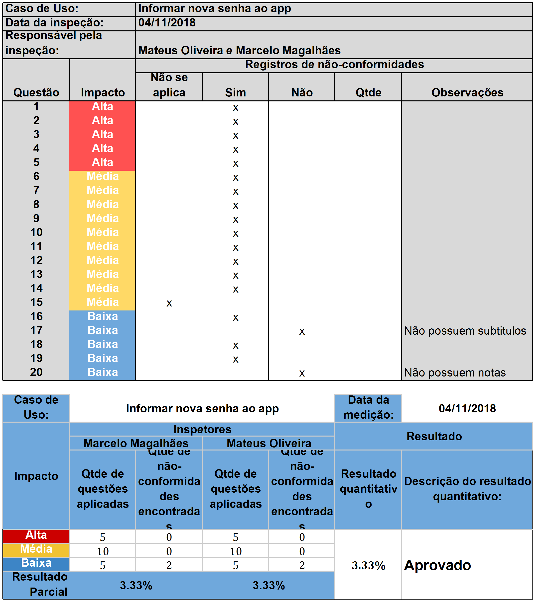

|Versionamento|
|-------|
|[Versões](https://requisitos-2018-2-evernote.github.io/Evernote/Analise-versões) |

### Inspeção de léxicos e cenários

#### Planejamento
Foi decidido pelo grupo de forma unânime que cada membro da equipe ficaria com uma parte ou funcionalidade do software Evernote, de forma a facilitar a identificação de erros para, posteriormente, serem corrigidos. A inspeção realizada está centrada nos modelos de Elicitação assim como suas respectivas técnicas escolhidas.

#### Visão geral
> * Cenários:
Os cenários são conhecidos como uma estratégia usada para não só evidenciar as interações entre ambientes e sistemas como também para elicitar toda a parte comportamental de um produto de software.
> * Léxicos:
Os léxicos se tratam de uma técnica que visa a descrição de símbolos de uma linguagem, semelhante a uma explicação de dicionário sobre o significado do mesmo.

#### Preparação
O grupo decidiu por realizar uma verificação completa pelas funcionalidade e documentação do software Evernote para que a técnica de inspeção de Leitura Baseada em Checklist (LBCh) cobrisse o máximo de cenários e léxicos possíveis.

#### Realização da inspeção
* Checklist de Inspeção dos Cenários e Léxicos
* Inspetor: Matheus Filipe
* Data: 02/11/2018

#### 1. Cenários
|Item de Inspeção|Cenários|
|----------------|--------|
|Questão|1 - Todos os cenários possuem ID?|
|Resposta|Sim.|
|Modificações|Todos os cenários foram identificados com seus respectivos IDs após evolução da versão 1.0|
|Questão|2 - Todos os cenários possuem título|
|Resposta|Sim.|
|Modificações|Nenhuma.|
|Questão|3 - Todos os cenários possuem sequência lógica de episódios?|
|Resposta|Sim.|
|Modificação|Nenhuma.|
|Questão|4 - Os episódios estão bem difinidos?|
|Resposta|Sim.|
|Modificações|Nenhuma.|
|Questão|5 - Os cenários estão abrangendo funcionalidades variadas do software?
|Resposta|Sim.|
|Modificações|Nenhuma.|

#### 2. Léxicos
|Item de Inspeção|Cenários|
|----------------|--------|
|Questão|1 - Todos os léxicos foram padronizados?|
|Resposta|Sim.|
|Modificações|Todos os léxicos foram adicionados e revisados para seguir um padrão em comum.|
|Questão|2 - Todos os léxicos possuem hyperlinks sem seus impactos e com outros léxicos?|
|Resposta|Sim.|
|Modificações|Foram adicionados hyperlinks fazendo conecções entre os léxicos e seus impactos.|
|Questão|3 - Todos os léxicos foram bem definidos?|
|Resposta|Sim.|
|Modificações|Nenhuma.|
|Questão|4 - Todos os léxicos possuem sinônimo?|
|Resposta|Sim(alguns léxicos como nomes de empresa ex:Google não possuem sinônimo).|
|Modificações|Nenhuma.|
|Questão|5 - As noções dos léxicos seguem uma padronização?|
|Resposta|Sim.|
|Modificações|Nenhuma.|

### Inspeção de Casos de uso

#### Questões

#### Inspeções

#### Acessar Caderno

[UCS01](https://requisitos-2018-2-evernote.github.io/Evernote/Modelagem2/#acessar-caderno)

#### Criar Caderno

[UCS02](https://requisitos-2018-2-evernote.github.io/Evernote/Modelagem2/#criar-caderno)

#### Acessar Nota

[UCS03](https://requisitos-2018-2-evernote.github.io/Evernote/Modelagem2/#acessar-nota)

#### Adicionar Etiqueta

[UCS04](https://requisitos-2018-2-evernote.github.io/Evernote/Modelagem2/#adicionar-etiqueta)

#### Adicionar Lembrete

[UCS05](https://requisitos-2018-2-evernote.github.io/Evernote/Modelagem2/#adicionar-lembrete)

#### Mudar para plano Premium

[UCS06](https://requisitos-2018-2-evernote.github.io/Evernote/Modelagem2/#mudar-para-plano-premium)

#### Administrar bloqueio de senha

[UCS07](https://requisitos-2018-2-evernote.github.io/Evernote/Modelagem2/#administrar-bloqueio-de-senha)

#### Informar senha ao aplicativo

[UCS08](https://requisitos-2018-2-evernote.github.io/Evernote/Modelagem2/#informar-senha-ao-aplicativo)

#### Verificar senha

[UCS09](https://requisitos-2018-2-evernote.github.io/Evernote/Modelagem2/#verificar-senha)

#### Notificar que a senha é inválida ao usuário

[UCS10](https://requisitos-2018-2-evernote.github.io/Evernote/Modelagem2/#notificar-que-a-senha-é-inválida-ao-usuário)

#### Desativar o bloqueio de senha

[UCS11](https://requisitos-2018-2-evernote.github.io/Evernote/Modelagem2/#desativar-o-bloqueio-de-senha)

#### Alterar a senha de bloqueio

[UCS12](https://requisitos-2018-2-evernote.github.io/Evernote/Modelagem2/#alterar-a-senha-de-bloqueio)

#### Informar nova senha ao app

[UCS13](https://requisitos-2018-2-evernote.github.io/Evernote/Modelagem2/#informar-nova-senha-ao-app)

