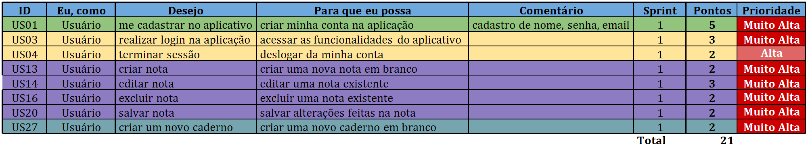
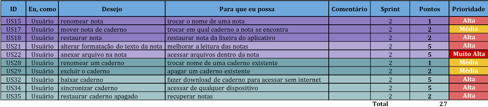
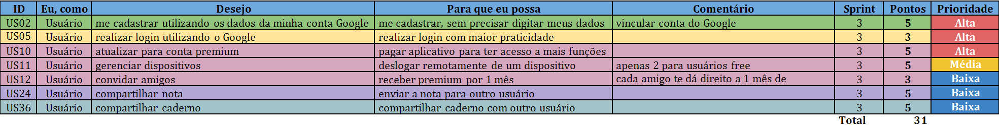
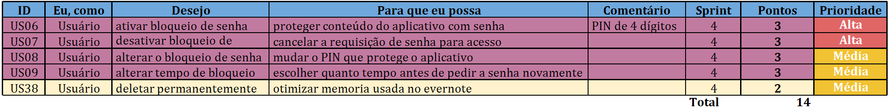
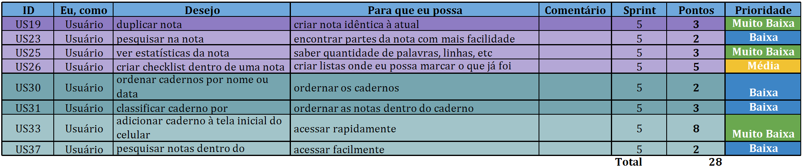

## Product Backlog

|Versionamento|
|-------|
|[Versões](https://requisitos-2018-2-evernote.github.io/Evernote/Modelagem3-versões) |

|ID| Product Backlog|
|--|--|
|[US01](https://requisitos-2018-2-evernote.github.io/Evernote/Modelagem3/#us01-fazer-cadastro-no-aplicativo)|Fazer cadastro no [aplicativo](https://requisitos-2018-2-evernote.github.io/Evernote/Modelagem/#aplicacao)|
|[US02](https://requisitos-2018-2-evernote.github.io/Evernote/Modelagem3/#us02-fazer-cadastro-no-aplicativo-utilizando-os-dados-da-minha-conta-google)|Fazer cadastro utilizando os dados da minha conta Google|
|[US03](https://requisitos-2018-2-evernote.github.io/Evernote/Modelagem3/#us03-realizar-login-na-aplicacao)|Realizar login na [aplicação](https://requisitos-2018-2-evernote.github.io/Evernote/Modelagem/#aplicacao)|
|[US04](https://requisitos-2018-2-evernote.github.io/Evernote/Modelagem3/#us04-terminar-sessao)|Terminar sessão |
|[US05](https://requisitos-2018-2-evernote.github.io/Evernote/Modelagem3/#us05-realizar-login-utilizando-o-google)|Realizar login utilizando o Google|
|[US06](https://requisitos-2018-2-evernote.github.io/Evernote/Modelagem3/#us06-ativar-bloqueio-de-senha)|Ativar bloqueio de [senha](https://requisitos-2018-2-evernote.github.io/Evernote/Modelagem/#codigo-de-acesso)|
|[US07](https://requisitos-2018-2-evernote.github.io/Evernote/Modelagem3/#us07-deativar-bloqueio-de-senha)|Desativar bloqueio de [senha](https://requisitos-2018-2-evernote.github.io/Evernote/Modelagem/#codigo-de-acesso)|
|[US08](https://requisitos-2018-2-evernote.github.io/Evernote/Modelagem3/#us08-alterar-o-bloqueio-de-senha)|Alterar o bloqueio de [senha](https://requisitos-2018-2-evernote.github.io/Evernote/Modelagem/#codigo-de-acesso)|
|[US09](https://requisitos-2018-2-evernote.github.io/Evernote/Modelagem3/#us09-alterar-tempo-de-bloqueio)|Alterar tempo de bloqueio|
|[US10](https://requisitos-2018-2-evernote.github.io/Evernote/Modelagem3/#us10-atualizar-para-conta-premium)|Atualizar para conta premium|
|[US11](https://requisitos-2018-2-evernote.github.io/Evernote/Modelagem3/#us11-gerenciar-dispositivos)|Gerenciar dispositivos|
|[US12](https://requisitos-2018-2-evernote.github.io/Evernote/Modelagem3/#us12-convidar-amigos)|Convidar amigos|
|[US13](https://requisitos-2018-2-evernote.github.io/Evernote/Modelagem3/#us13-criar-nota)|Criar [nota](https://requisitos-2018-2-evernote.github.io/Evernote/Modelagem/#nota)|
|[US14](https://requisitos-2018-2-evernote.github.io/Evernote/Modelagem3/#us14-editar-nota)|Editar [nota](https://requisitos-2018-2-evernote.github.io/Evernote/Modelagem/#nota)|
|[US15](https://requisitos-2018-2-evernote.github.io/Evernote/Modelagem3/#us15-renomear-nota)|Renomear [nota](https://requisitos-2018-2-evernote.github.io/Evernote/Modelagem/#nota)|
|[US16](https://requisitos-2018-2-evernote.github.io/Evernote/Modelagem3/#us16-excluir-nota)|Excluir [nota](https://requisitos-2018-2-evernote.github.io/Evernote/Modelagem/#nota)|
|[US17](https://requisitos-2018-2-evernote.github.io/Evernote/Modelagem3/#us17-mover-nota-de-caderno)|Mover [nota](https://requisitos-2018-2-evernote.github.io/Evernote/Modelagem/#nota) de [caderno](https://requisitos-2018-2-evernote.github.io/Evernote/Modelagem/#caderno)|
|[US18](https://requisitos-2018-2-evernote.github.io/Evernote/Modelagem3/#us18-restaurar-nota-de-caderno)|Restaurar [nota](https://requisitos-2018-2-evernote.github.io/Evernote/Modelagem/#nota) de [caderno](https://requisitos-2018-2-evernote.github.io/Evernote/Modelagem/#caderno)|
|[US19](https://requisitos-2018-2-evernote.github.io/Evernote/Modelagem3/#us19-duplicar-nota)|Duplicar [nota](https://requisitos-2018-2-evernote.github.io/Evernote/Modelagem/#nota)|
|[US20](https://requisitos-2018-2-evernote.github.io/Evernote/Modelagem3/#us20-salvar-nota)|Salvar [nota](https://requisitos-2018-2-evernote.github.io/Evernote/Modelagem/#nota)|
|[US21](https://requisitos-2018-2-evernote.github.io/Evernote/Modelagem3/#us21-alterar-formatacao-do-texto-da-nota)|Alterar formatação do texto da [nota](https://requisitos-2018-2-evernote.github.io/Evernote/Modelagem/#nota)|
|[US22](https://requisitos-2018-2-evernote.github.io/Evernote/Modelagem3/#us22-anexar-arquivo-na-nota)|Anexar arquivo na [nota](https://requisitos-2018-2-evernote.github.io/Evernote/Modelagem/#nota)|
|[US23](https://requisitos-2018-2-evernote.github.io/Evernote/Modelagem3/#us23-pesquisar-na-nota)|Pesquisar na [nota](https://requisitos-2018-2-evernote.github.io/Evernote/Modelagem/#nota)|
|[US24](https://requisitos-2018-2-evernote.github.io/Evernote/Modelagem3/#us24-compartilhar-nota)|Compartilhar [nota](https://requisitos-2018-2-evernote.github.io/Evernote/Modelagem/#nota)|
|[US25](https://requisitos-2018-2-evernote.github.io/Evernote/Modelagem3/#us25-ver-estatísticas-da-nota)|Ver estatísticas da [nota](https://requisitos-2018-2-evernote.github.io/Evernote/Modelagem/#nota)|
|[US26](https://requisitos-2018-2-evernote.github.io/Evernote/Modelagem3/#us26-criar-checklist-dentro-de-uma-nota)|Criar checklist dentro de uma [nota](https://requisitos-2018-2-evernote.github.io/Evernote/Modelagem/#nota)|
|[US27](https://requisitos-2018-2-evernote.github.io/Evernote/Modelagem3/#us27-criar-um-novo-caderno)|Criar um novo [caderno](https://requisitos-2018-2-evernote.github.io/Evernote/Modelagem/#caderno)|
|[US28](https://requisitos-2018-2-evernote.github.io/Evernote/Modelagem3/#us28-renomear-um-caderno)|Renomear um [caderno](https://requisitos-2018-2-evernote.github.io/Evernote/Modelagem/#caderno)|
|[US29](https://requisitos-2018-2-evernote.github.io/Evernote/Modelagem3/#us29-excluir-o-caderno)|Excluir o [caderno](https://requisitos-2018-2-evernote.github.io/Evernote/Modelagem/#caderno)|
|[US30](https://requisitos-2018-2-evernote.github.io/Evernote/Modelagem3/#us30-ordenar-cadernos-por-nome-ou-data)|Ordenar [cadernos](https://requisitos-2018-2-evernote.github.io/Evernote/Modelagem/#caderno) por nome ou data|
|[US31](https://requisitos-2018-2-evernote.github.io/Evernote/Modelagem3/#us31-classificar-caderno)|Classificar [caderno](https://requisitos-2018-2-evernote.github.io/Evernote/Modelagem/#caderno)|
|[US32](https://requisitos-2018-2-evernote.github.io/Evernote/Modelagem3/#us32-baixar-caderno)|Baixar [caderno](https://requisitos-2018-2-evernote.github.io/Evernote/Modelagem/#caderno)|
|[US33](https://requisitos-2018-2-evernote.github.io/Evernote/Modelagem3/#us33-adicionar-caderno-a-tela-inicial-do-celular)|Adicionar [caderno](https://requisitos-2018-2-evernote.github.io/Evernote/Modelagem/#caderno) à tela inicial do celular|
|[US34](https://requisitos-2018-2-evernote.github.io/Evernote/Modelagem3/#us34-sincronizar-caderno)|Sincronizar [caderno](https://requisitos-2018-2-evernote.github.io/Evernote/Modelagem/#caderno)|
|[US35](https://requisitos-2018-2-evernote.github.io/Evernote/Modelagem3/#us35-restaurar-caderno-apagado)|Restaurar [caderno](https://requisitos-2018-2-evernote.github.io/Evernote/Modelagem/#caderno) apagado|
|[US36](https://requisitos-2018-2-evernote.github.io/Evernote/Modelagem3/#us36-compartilhar-caderno)|Compartilhar [caderno](https://requisitos-2018-2-evernote.github.io/Evernote/Modelagem/#caderno)|
|[US37](https://requisitos-2018-2-evernote.github.io/Evernote/Modelagem3/#us37-pesquisar-notas-dentro-do-caderno)|Pesquisar [notas](https://requisitos-2018-2-evernote.github.io/Evernote/Modelagem/#nota) dentro do [caderno](https://requisitos-2018-2-evernote.github.io/Evernote/Modelagem/#caderno)|
|[US38](https://requisitos-2018-2-evernote.github.io/Evernote/Modelagem3/#us38-deletar-permanentemente)|Deletar permanentemente|

#### Cadastro

| Tema     | Épico                         | ID   | "Eu, como" | Desejo                                                 | Para que eu possa                                      | Comentário                                  | Sprint | pontos | prioridade  | 
|----------|-------------------------------|------|------------|--------------------------------------------------------|--------------------------------------------------------|---------------------------------------------|--------|--------|-------------| 
| Cadastro |                               | US01 | [Usuário](https://requisitos-2018-2-evernote.github.io/Evernote/Modelagem/#usuario)    | me cadastrar no [aplicativo](https://requisitos-2018-2-evernote.github.io/Evernote/Modelagem/#aplicacao)                             | criar minha conta na [aplicação](https://requisitos-2018-2-evernote.github.io/Evernote/Modelagem/#aplicacao)                         | "cadastro de nome, [senha](https://requisitos-2018-2-evernote.github.io/Evernote/Modelagem/#codigo-de-acesso), email"            | 1      | 5      | Muito Alta  | 
|          |                               | US02 | [Usuário](https://requisitos-2018-2-evernote.github.io/Evernote/Modelagem/#usuario)    | me cadastrar utilizando os dados da minha conta Google | "me cadastrar, sem precisar digitar meus dados"        | vincular conta do Google                    | 3      | 5      | Alta        | 

##### US01 - Fazer cadastro no [aplicativo](https://requisitos-2018-2-evernote.github.io/Evernote/Modelagem/#aplicacao)

**Criterios de Aceitação**

- Deve ser apresentado uma campo para inserção do E-mail

- Deve ser apresentado uma campo para inserção da [Senha](https://requisitos-2018-2-evernote.github.io/Evernote/Modelagem/#codigo-de-acesso)

- Deve ser efetuado o cadastro

##### US02 - Fazer cadastro utilizando os dados da minha conta Google

**Criterios de Aceitação**

-  Deve pedir permissão da conta Google

- Deve ser efetuado o cadastro

#### Login

| Tema     | Épico                         | ID   | "Eu, como" | Desejo                                                 | Para que eu possa                                      | Comentário                                  | Sprint | pontos | prioridade  | 
|----------|-------------------------------|------|------------|--------------------------------------------------------|--------------------------------------------------------|---------------------------------------------|--------|--------|-------------| 
| Login    |                               | US03 | [Usuário](https://requisitos-2018-2-evernote.github.io/Evernote/Modelagem/#usuario)    | realizar login na [aplicação](https://requisitos-2018-2-evernote.github.io/Evernote/Modelagem/#aplicacao)                            | acessar as funcionalidades do [aplicativo](https://requisitos-2018-2-evernote.github.io/Evernote/Modelagem/#aplicacao)               |                                             | 1      | 3      | Muito Alta  | 
|          |                               | US04 | [Usuário](https://requisitos-2018-2-evernote.github.io/Evernote/Modelagem/#usuario)    | terminar sessão                                        | deslogar da minha conta                                |                                             | 1      | 2      | Alta        | 
|          |                               | US05 | [Usuário](https://requisitos-2018-2-evernote.github.io/Evernote/Modelagem/#usuario)    | realizar login utilizando o Google                     | realizar login com maior praticidade                   |       

##### US03 - Realizar login na [aplicação](https://requisitos-2018-2-evernote.github.io/Evernote/Modelagem/#aplicacao)

**Criterios de Aceitação**

-  Deve ser apresentado uma campo para inserção do E-mail

- Deve ser apresentado uma campo para inserção da [Senha](https://requisitos-2018-2-evernote.github.io/Evernote/Modelagem/#codigo-de-acesso)

- Deve ser efetuado o login

##### US04 - Terminar sessão

**Criterios de Aceitação**

- Deve ser deslogado ao clicar no botão de deslogar

- Deve voltar para a página inicial

##### US05 - Realizar login utilizando o Google

**Criterios de Aceitação**

- Deve haver um campo para login com conta google

- Deve aparecer confirmação de login com conta Google

#### Conta

| Tema     | Épico                         | ID   | "Eu, como" | Desejo                                                 | Para que eu possa                                      | Comentário                                  | Sprint | pontos | prioridade  | 
|----------|-------------------------------|------|------------|--------------------------------------------------------|--------------------------------------------------------|---------------------------------------------|--------|--------|-------------| 
| Conta    | Administrar bloqueio de [senha](https://requisitos-2018-2-evernote.github.io/Evernote/Modelagem/#codigo-de-acesso) | US06 | [Usuário](https://requisitos-2018-2-evernote.github.io/Evernote/Modelagem/#usuario)    | ativar bloqueio de [senha](https://requisitos-2018-2-evernote.github.io/Evernote/Modelagem/#codigo-de-acesso)                               | proteger conteúdo do [aplicativo](https://requisitos-2018-2-evernote.github.io/Evernote/Modelagem/#aplicacao) com [senha](https://requisitos-2018-2-evernote.github.io/Evernote/Modelagem/#codigo-de-acesso)              | PIN de 4 dígitos                            | 4      | 3      | Alta        | 
|          |                               | US07 | [Usuário](https://requisitos-2018-2-evernote.github.io/Evernote/Modelagem/#usuario)    | desativar bloqueio de [senha](https://requisitos-2018-2-evernote.github.io/Evernote/Modelagem/#codigo-de-acesso)                            | cancelar a requisição de [senha](https://requisitos-2018-2-evernote.github.io/Evernote/Modelagem/#codigo-de-acesso) para acesso             |                                             | 4      | 3      | Alta        | 
|          |                               | US08 | [Usuário](https://requisitos-2018-2-evernote.github.io/Evernote/Modelagem/#usuario)    | alterar o bloqueio de [senha](https://requisitos-2018-2-evernote.github.io/Evernote/Modelagem/#codigo-de-acesso)                            | mudar o PIN que protege o [aplicativo](https://requisitos-2018-2-evernote.github.io/Evernote/Modelagem/#aplicacao)                   |                                             | 4      | 3      | Média       | 
|          |                               | US09 | [Usuário](https://requisitos-2018-2-evernote.github.io/Evernote/Modelagem/#usuario)    | alterar tempo de bloqueio                              | escolher quanto tempo antes de pedir a [senha](https://requisitos-2018-2-evernote.github.io/Evernote/Modelagem/#codigo-de-acesso) novamente |                                             | 4      | 3      | Média       | 
|          |                               | US10 | [Usuário](https://requisitos-2018-2-evernote.github.io/Evernote/Modelagem/#usuario)    | atualizar para conta premium                           | pagar [aplicativo](https://requisitos-2018-2-evernote.github.io/Evernote/Modelagem/#aplicacao) para ter acesso a mais funções        |                                             | 3      | 5      | Alta        | 
|          |                               | US11 | [Usuário](https://requisitos-2018-2-evernote.github.io/Evernote/Modelagem/#usuario)    | gerenciar dispositivos                                 | deslogar remotamente de um dispositivo                 | apenas 2 para [usuários](https://requisitos-2018-2-evernote.github.io/Evernote/Modelagem/#usuario) free                 | 3      | 5      | Média       | 
|          |                               | US12 | [Usuário](https://requisitos-2018-2-evernote.github.io/Evernote/Modelagem/#usuario)    | convidar amigos                                        | receber premium por 1 mês                              | cada amigo te dá direito a 1 mês de premium | 3      | 3      | Baixa       | 

#### [Nota](https://requisitos-2018-2-evernote.github.io/Evernote/Modelagem/#nota)

| Tema     | Épico                         | ID   | "Eu, como" | Desejo                                                 | Para que eu possa                                      | Comentário                                  | Sprint | pontos | prioridade  | 
|----------|-------------------------------|------|------------|--------------------------------------------------------|--------------------------------------------------------|---------------------------------------------|--------|--------|-------------| 
| [Nota](https://requisitos-2018-2-evernote.github.io/Evernote/Modelagem/#nota)     | Gerenciar [notas](https://requisitos-2018-2-evernote.github.io/Evernote/Modelagem/#nota)               | US13 | [Usuário](https://requisitos-2018-2-evernote.github.io/Evernote/Modelagem/#usuario)    | criar [nota](https://requisitos-2018-2-evernote.github.io/Evernote/Modelagem/#nota)                                             | criar uma nova [nota](https://requisitos-2018-2-evernote.github.io/Evernote/Modelagem/#nota) em branco                          |                                             | 1      | 2      | Muito Alta  | 
|          |                               | US14 | [Usuário](https://requisitos-2018-2-evernote.github.io/Evernote/Modelagem/#usuario)    | editar [nota](https://requisitos-2018-2-evernote.github.io/Evernote/Modelagem/#nota)                                            | editar uma [nota](https://requisitos-2018-2-evernote.github.io/Evernote/Modelagem/#nota) existente                              |                                             | 1      | 3      | Muito Alta  | 
|          |                               | US15 | [Usuário](https://requisitos-2018-2-evernote.github.io/Evernote/Modelagem/#usuario)    | renomear [nota](https://requisitos-2018-2-evernote.github.io/Evernote/Modelagem/#nota)                                          | trocar o nome de uma [nota](https://requisitos-2018-2-evernote.github.io/Evernote/Modelagem/#nota)                              |                                             | 2      | 1      | Alta        | 
|          |                               | US16 | [Usuário](https://requisitos-2018-2-evernote.github.io/Evernote/Modelagem/#usuario)    | excluir [nota](https://requisitos-2018-2-evernote.github.io/Evernote/Modelagem/#nota)                                           | excluir uma [nota](https://requisitos-2018-2-evernote.github.io/Evernote/Modelagem/#nota) existente                             |                                             | 1      | 2      | Muito Alta  | 
|          |                               | US17 | [Usuário](https://requisitos-2018-2-evernote.github.io/Evernote/Modelagem/#usuario)    | mover [nota](https://requisitos-2018-2-evernote.github.io/Evernote/Modelagem/#nota) de [caderno](https://requisitos-2018-2-evernote.github.io/Evernote/Modelagem/#caderno)                                  | trocar em qual [caderno](https://requisitos-2018-2-evernote.github.io/Evernote/Modelagem/#caderno) a [nota](https://requisitos-2018-2-evernote.github.io/Evernote/Modelagem/#nota) se encontra              |                                             | 2      | 2      | Média       | 
|          |                               | US18 | [Usuário](https://requisitos-2018-2-evernote.github.io/Evernote/Modelagem/#usuario)    | restaurar [nota](https://requisitos-2018-2-evernote.github.io/Evernote/Modelagem/#nota)                                         | restaurar [nota](https://requisitos-2018-2-evernote.github.io/Evernote/Modelagem/#nota) da lixeira do [aplicativo](https://requisitos-2018-2-evernote.github.io/Evernote/Modelagem/#aplicacao)                |                                             | 2      | 2      | Alta        | 
|          |                               | US19 | [Usuário](https://requisitos-2018-2-evernote.github.io/Evernote/Modelagem/#usuario)    | duplicar [nota](https://requisitos-2018-2-evernote.github.io/Evernote/Modelagem/#nota)                                          | criar [nota](https://requisitos-2018-2-evernote.github.io/Evernote/Modelagem/#nota) idêntica à atual                            |                                             | 5      | 3      | Muito Baixa | 
|          |                               | US20 | [Usuário](https://requisitos-2018-2-evernote.github.io/Evernote/Modelagem/#usuario)    | salvar [nota](https://requisitos-2018-2-evernote.github.io/Evernote/Modelagem/#nota)                                            | salvar alterações feitas na [nota](https://requisitos-2018-2-evernote.github.io/Evernote/Modelagem/#nota)                       |                                             | 1      | 2      | Muito Alta  | 
|          |                               | US21 | [Usuário](https://requisitos-2018-2-evernote.github.io/Evernote/Modelagem/#usuario)    | alterar formatação do texto da [nota](https://requisitos-2018-2-evernote.github.io/Evernote/Modelagem/#nota)                    | melhorar a leitura das [notas](https://requisitos-2018-2-evernote.github.io/Evernote/Modelagem/#nota)                           |                                             | 2      | 5      | Alta        | 
|          |                               | US22 | [Usuário](https://requisitos-2018-2-evernote.github.io/Evernote/Modelagem/#usuario)    | anexar arquivo na [nota](https://requisitos-2018-2-evernote.github.io/Evernote/Modelagem/#nota)                                 | acessar arquivos dentro da [nota](https://requisitos-2018-2-evernote.github.io/Evernote/Modelagem/#nota)                        |                                             | 2      | 5      | Muito Alta  | 
|          |                               | US23 | [Usuário](https://requisitos-2018-2-evernote.github.io/Evernote/Modelagem/#usuario)    | pesquisar na [nota](https://requisitos-2018-2-evernote.github.io/Evernote/Modelagem/#nota)                                      | encontrar partes da [nota](https://requisitos-2018-2-evernote.github.io/Evernote/Modelagem/#nota) com mais facilidade           |                                             | 5      | 2      | Baixa       | 
|          |                               | US24 | [Usuário](https://requisitos-2018-2-evernote.github.io/Evernote/Modelagem/#usuario)    | [compartilhar](https://requisitos-2018-2-evernote.github.io/Evernote/Modelagem/#compartilhar) [nota](https://requisitos-2018-2-evernote.github.io/Evernote/Modelagem/#nota)                                      | enviar a [nota](https://requisitos-2018-2-evernote.github.io/Evernote/Modelagem/#nota) para outro [usuário](https://requisitos-2018-2-evernote.github.io/Evernote/Modelagem/#usuario)                       |                                             | 3      | 5      | Baixa       | 
|          |                               | US25 | [Usuário](https://requisitos-2018-2-evernote.github.io/Evernote/Modelagem/#usuario)    | ver estatísticas da [nota](https://requisitos-2018-2-evernote.github.io/Evernote/Modelagem/#nota)                               | "saber quantidade de palavras, linhas, etc"            |                                             | 5      | 3      | Muito Baixa | 
|          |                               | US26 | [Usuário](https://requisitos-2018-2-evernote.github.io/Evernote/Modelagem/#usuario)    | criar checklist dentro de uma [nota](https://requisitos-2018-2-evernote.github.io/Evernote/Modelagem/#nota)                     | criar listas onde eu possa marcar o que já foi feito   |                                             | 5      | 5      | Média       | 

##### US13 - Criar [Nota](https://requisitos-2018-2-evernote.github.io/Evernote/Modelagem/#nota)

**Criterios de Aceitação**

- Deve haver a opção de criar uma [nota](https://requisitos-2018-2-evernote.github.io/Evernote/Modelagem/#nota) em branco

- Deve abrir a [nota](https://requisitos-2018-2-evernote.github.io/Evernote/Modelagem/#nota) criada

##### US14 - Editar [Nota](https://requisitos-2018-2-evernote.github.io/Evernote/Modelagem/#nota)

**Criterios de Aceitação**

- Deve permitir a edição da [nota](https://requisitos-2018-2-evernote.github.io/Evernote/Modelagem/#nota) já existente

- Deve salvar ao fechar a [nota](https://requisitos-2018-2-evernote.github.io/Evernote/Modelagem/#nota)

##### US15 - Renomear [Nota](https://requisitos-2018-2-evernote.github.io/Evernote/Modelagem/#nota)

**Criterios de Aceitação**

- Deve permitir a edição da título já existente

- Deve salvar ao fechar a [nota](https://requisitos-2018-2-evernote.github.io/Evernote/Modelagem/#nota)

##### US16 - Excluir [Nota](https://requisitos-2018-2-evernote.github.io/Evernote/Modelagem/#nota)

**Criterios de Aceitação**

- Deve mover [nota](https://requisitos-2018-2-evernote.github.io/Evernote/Modelagem/#nota) para lixeira ao excluir [nota](https://requisitos-2018-2-evernote.github.io/Evernote/Modelagem/#nota)

- Deve fechar a [nota](https://requisitos-2018-2-evernote.github.io/Evernote/Modelagem/#nota)

##### US17 - Mover [Nota](https://requisitos-2018-2-evernote.github.io/Evernote/Modelagem/#nota) de [Caderno](https://requisitos-2018-2-evernote.github.io/Evernote/Modelagem/#caderno)

**Criterios de Aceitação**

- Deve aparecer lista de [cadernos](https://requisitos-2018-2-evernote.github.io/Evernote/Modelagem/#caderno) já existentes

- Deve aparecer opção de criar novo [caderno](https://requisitos-2018-2-evernote.github.io/Evernote/Modelagem/#caderno)

- A [nota](https://requisitos-2018-2-evernote.github.io/Evernote/Modelagem/#nota) deve estar no endereço do [caderno](https://requisitos-2018-2-evernote.github.io/Evernote/Modelagem/#caderno) para o qual foi movido

##### US18 - Restaurar [Nota](https://requisitos-2018-2-evernote.github.io/Evernote/Modelagem/#nota) de [Caderno](https://requisitos-2018-2-evernote.github.io/Evernote/Modelagem/#caderno)

**Criterios de Aceitação**

- A [nota](https://requisitos-2018-2-evernote.github.io/Evernote/Modelagem/#nota) deve voltar para o [caderno](https://requisitos-2018-2-evernote.github.io/Evernote/Modelagem/#caderno) ao qual ela pertencia antes de ser excluída

##### US19 - Duplicar [Nota](https://requisitos-2018-2-evernote.github.io/Evernote/Modelagem/#nota)

**Criterios de Aceitação**

- Deve criar um [nota](https://requisitos-2018-2-evernote.github.io/Evernote/Modelagem/#nota) idêntica no mesmo [caderno](https://requisitos-2018-2-evernote.github.io/Evernote/Modelagem/#caderno) da [nota](https://requisitos-2018-2-evernote.github.io/Evernote/Modelagem/#nota) original

##### US20 - Salvar [Nota](https://requisitos-2018-2-evernote.github.io/Evernote/Modelagem/#nota)

**Criterios de Aceitação**

- Deve haver opção de salvar

- Deve salvar a [nota](https://requisitos-2018-2-evernote.github.io/Evernote/Modelagem/#nota) automaticamente ao fechá-la

#### [Caderno](https://requisitos-2018-2-evernote.github.io/Evernote/Modelagem/#caderno)

| Tema     | Épico                         | ID   | "Eu, como" | Desejo                                                 | Para que eu possa                                      | Comentário                                  | Sprint | pontos | prioridade  | 
|----------|-------------------------------|------|------------|--------------------------------------------------------|--------------------------------------------------------|---------------------------------------------|--------|--------|-------------| 
| [Caderno](https://requisitos-2018-2-evernote.github.io/Evernote/Modelagem/#caderno)  | Gerenciar [cadernos](https://requisitos-2018-2-evernote.github.io/Evernote/Modelagem/#caderno)            | US27 | [Usuário](https://requisitos-2018-2-evernote.github.io/Evernote/Modelagem/#usuario)    | criar um novo [caderno](https://requisitos-2018-2-evernote.github.io/Evernote/Modelagem/#caderno)                                  | criar uma novo [caderno](https://requisitos-2018-2-evernote.github.io/Evernote/Modelagem/#caderno) em branco                       |                                             | 1      | 2      | Muito Alta  | 
|          |                               | US28 | [Usuário](https://requisitos-2018-2-evernote.github.io/Evernote/Modelagem/#usuario)    | renomear um [caderno](https://requisitos-2018-2-evernote.github.io/Evernote/Modelagem/#caderno)                                    | trocar nome de uma [caderno](https://requisitos-2018-2-evernote.github.io/Evernote/Modelagem/#caderno) existente                   |                                             | 2      | 1      | Média       | 
|          |                               | US29 | [Usuário](https://requisitos-2018-2-evernote.github.io/Evernote/Modelagem/#usuario)    | excluir o [caderno](https://requisitos-2018-2-evernote.github.io/Evernote/Modelagem/#caderno)                                      | apagar um [caderno](https://requisitos-2018-2-evernote.github.io/Evernote/Modelagem/#caderno) existente                            |                                             | 2      | 2      | Média       | 
|          |                               | US30 | [Usuário](https://requisitos-2018-2-evernote.github.io/Evernote/Modelagem/#usuario)    | ordenar [cadernos](https://requisitos-2018-2-evernote.github.io/Evernote/Modelagem/#caderno) por nome ou data                      | ordernar os [cadernos](https://requisitos-2018-2-evernote.github.io/Evernote/Modelagem/#caderno)                                   |                                             | 5      | 2      | Baixa       | 
|          |                               | US31 | [Usuário](https://requisitos-2018-2-evernote.github.io/Evernote/Modelagem/#usuario)    | classificar [caderno](https://requisitos-2018-2-evernote.github.io/Evernote/Modelagem/#caderno) por                                | ordernar as [notas](https://requisitos-2018-2-evernote.github.io/Evernote/Modelagem/#nota) dentro do [caderno](https://requisitos-2018-2-evernote.github.io/Evernote/Modelagem/#caderno)                    |                                             | 5      | 3      | Baixa       | 
|          |                               | US32 | [Usuário](https://requisitos-2018-2-evernote.github.io/Evernote/Modelagem/#usuario)    | baixar [caderno](https://requisitos-2018-2-evernote.github.io/Evernote/Modelagem/#caderno)                                         | fazer download de [caderno](https://requisitos-2018-2-evernote.github.io/Evernote/Modelagem/#caderno) para acessar sem internet    |                                             | 2      | 5      | Alta        | 
|          |                               | US33 | [Usuário](https://requisitos-2018-2-evernote.github.io/Evernote/Modelagem/#usuario)    | adicionar [caderno](https://requisitos-2018-2-evernote.github.io/Evernote/Modelagem/#caderno) à tela inicial do celular            | acessar rapidamente                                    |                                             | 5      | 8      | Muito Baixa | 
|          |                               | US34 | [Usuário](https://requisitos-2018-2-evernote.github.io/Evernote/Modelagem/#usuario)    | sincronizar [caderno](https://requisitos-2018-2-evernote.github.io/Evernote/Modelagem/#caderno)                                    | acessar de qualquer dispositivo                        |                                             | 2      | 5      | Alta        | 
|          |                               | US35 | [Usuário](https://requisitos-2018-2-evernote.github.io/Evernote/Modelagem/#usuario)    | restaurar [caderno](https://requisitos-2018-2-evernote.github.io/Evernote/Modelagem/#caderno) apagado                              | recuperar [notas](https://requisitos-2018-2-evernote.github.io/Evernote/Modelagem/#nota)                                        |                                             | 2      | 2      | Alta        | 
|          |                               | US36 | [Usuário](https://requisitos-2018-2-evernote.github.io/Evernote/Modelagem/#usuario)    | [compartilhar](https://requisitos-2018-2-evernote.github.io/Evernote/Modelagem/#compartilhar) [caderno](https://requisitos-2018-2-evernote.github.io/Evernote/Modelagem/#caderno)                                   | [compartilhar](https://requisitos-2018-2-evernote.github.io/Evernote/Modelagem/#compartilhar) [caderno](https://requisitos-2018-2-evernote.github.io/Evernote/Modelagem/#caderno) com outro [usuário](https://requisitos-2018-2-evernote.github.io/Evernote/Modelagem/#usuario)                 |                                             | 3      | 5      | Baixa       | 
|          |                               | US37 | [Usuário](https://requisitos-2018-2-evernote.github.io/Evernote/Modelagem/#usuario)    | pesquisar [notas](https://requisitos-2018-2-evernote.github.io/Evernote/Modelagem/#nota) dentro do [caderno](https://requisitos-2018-2-evernote.github.io/Evernote/Modelagem/#caderno)                      | acessar facilmente                                     |                                             | 5      | 2      | Baixa       | 

## Resultado
#### Sprint 1

#### Sprint 2

#### Sprint 3

#### Sprint 4

#### Sprint 5

## Conclusão

Obtivemos 38 histórias de [usuário](https://requisitos-2018-2-evernote.github.io/Evernote/Modelagem/#usuario), totalizando 121 pontos.

Clique [aqui](https://docs.google.com/spreadsheets/d/1cEXzIZBpXOSc3k0KLjiRVBGG20TGeL6wHlkrhHpQw2I/edit#gid=1512588497) para ter acesso ao Product Backlog completo.
