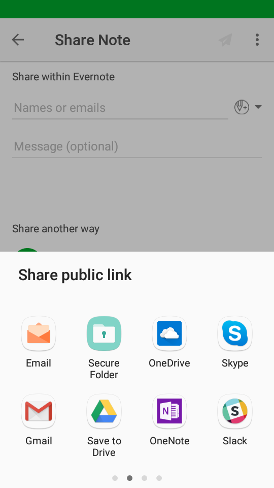
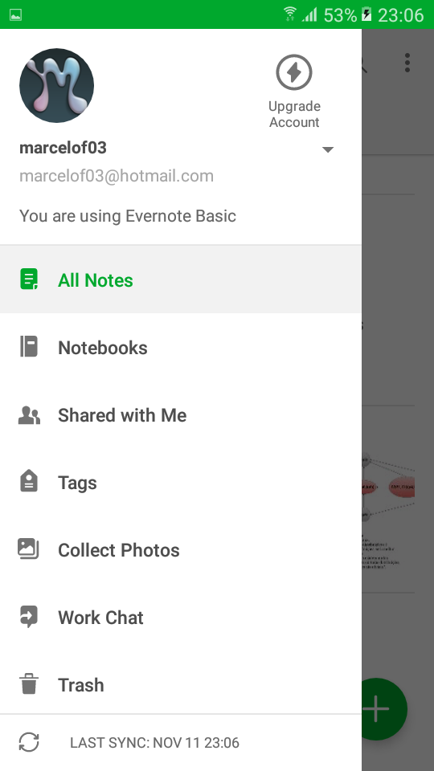
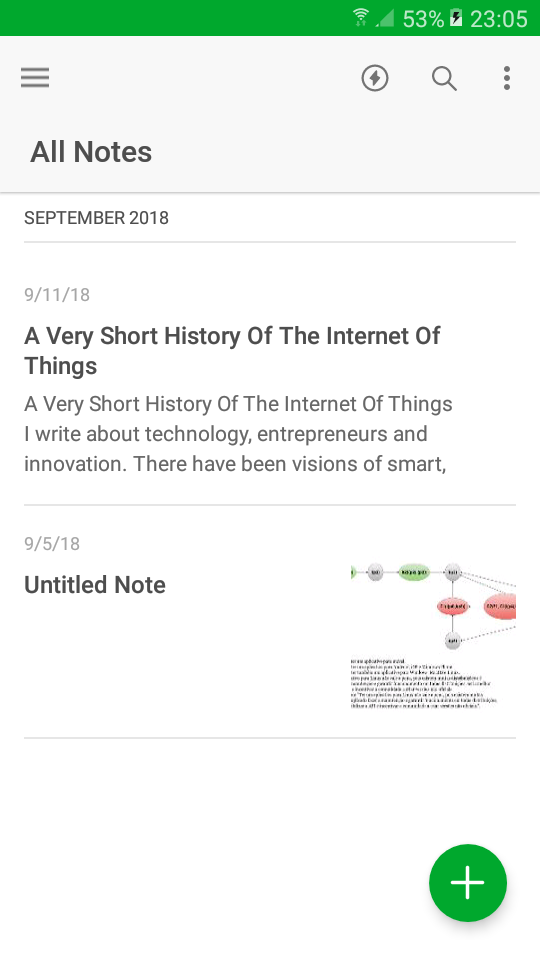

#Matrizes de Rastreabilidade-Versões

## Forward-To

#### Versão 1.0

#### Versão 1.1

## Forward-From 

#### Versão 1.0
 | App | Web | Rastros|
|--|--|--|
|  |  | |
 |  |  | |
 |  |  | |
 |  |  | |
 | |  | |
 | |  | |
 |    |  | |
 |  |  | |
 |  |  | |
 |  |  | |
 |  |  | |
 |  |  | |

## Backward-From

#### Versão 1.0

#### Versão 1.1

#### Versão 2.0

| ID     | Requisito                                    | Product Backlog | Esp. Casos de  Uso                  | Cenário | Léxico             | MoSCoW | First Things First | Análise de Protocolo/Observação Participativa | Storytelling/Brainstorm | Questionário | RichPicture                   | Gráfico i*                                                                             | 
|--------|----------------------------------------------|-----------------|-------------------------------------|---------|--------------------|--------|--------------------|-----------------------------------------------|-------------------------|--------------|-------------------------------|----------------------------------------------------------------------------------------| 
| RF01   | Etiquetar nota                               | US38            | UC 12 - Criar etiqueta              | CE17    | Nota               | -      | -                  | Análise de Protocolo                          | Storytelling            | -            | RP01 - Visão geral|versão 1.0 | [i* Nota] Task - Adicionar Etiqueta                                                    | 
| RF02   | Coletar Fotos                                | US02            | -                                   | CE16    | -                  | -      | First Things First | Análise de Protocolo                          | -                       | -            | RP01 - Visão geral|versão 1.0 | -                                                                                      | 
| RF03   | Sincronizar dispositivo                      | US03            | -                                   | -       | -                  | MoSCoW | -                  | -                                             | Brainstorm              | -            | RP01 - Visão geral|versão 1.0 | [i* Sincronia de dados] Task - Solicitar sincronização                                 | 
| RF04   | Gravar nota de áudio                         | US04            | -                                   | -       | Nota               | MoSCoW | First Things First | -                                             | Brainstorm              | -            | RP01 - Visão geral|versão 1.0 | -                                                                                      | 
| RF05   | Anexar arquivos em nota                      | US05            | -                                   | -       | Anexo              | MoSCoW | -                  | Análise de Protocolo                          | -                       | -            | RP01 - Visão geral|versão 1.0 | [i* Usuário/Nota] Task - Adicionar anexo                                               | 
| RF06   | Criar nota de caligrafia                     | US06            | -                                   | -       | Nota               | -      | First Things First | -                                             | -                       | -            | RP06 - Visão geral|versão 1.0 | -                                                                                      | 
| RF07   | Digitalizar documento                        | US07            | -                                   | -       | Digitalização      | -      | First Things First | -                                             | -                       | -            | RP10 - Pequenas Empresas      | -                                                                                      | 
| RF08   | Usar buscador de texto                       | -               | UC05 - Pesquisar nota               | CE20    | -                  | MoSCoW | First Things First | Análise de Protocolo                          | -                       | -            | -                             | [i* Usuário/Nota] Task - Pesquisar na nota                                             | 
| RF09   | Criar lista                                  | US08            | -                                   | -       | -                  | -      | -                  | -                                             | -                       | -            | RP02 - Visão geral            | -                                                                                      | 
| RF10   | Criar lembrete                               | US09            | UC03 - Criar Lembrete               | CE04    | Lembrete           | -      | -                  | Análise de Protocolo                          | Storytelling            | -            | RP03 - Visão geral            | [i* Geral] Task - Criar lembrete                                                       | 
| RF11   | Nomear lembrete                              | US10            | UC03 - Criar Lembrete               | -       | Lembrete           | -      | -                  | Análise de Protocolo                          | -                       | -            | RP07 - Visão geral            | -                                                                                      | 
| RNF12  | Dados dispostos na núvem                     | -               | -                                   | -       | Núvem              | -      | -                  | -                                             | -                       | Questionário | RP04 - Visão geral            | [i* Armazenar em núvem] Actor - Google Cloud Platform                                  | 
| RF13   | Compartilhar nota                            | US12            | -                                   | CE22    | Nota               | MoSCoW | First Things First | Análise de Protocolo                          | Brainstorm              | Questionário | RP06 - Visão geral            | [i* Nota] Hardgoal - Compartilhamento seja realizado                                   | 
| RF14   | Logar usando conta Google                    | -               | -                                   | -       | Google             | MoSCoW | -                  | -                                             | -                       | Questionário | -                             | [i* Geral] Actor - Google / Resource - Login via Google                                | 
| RF15   | Adicionar caderno aos atalhos                | -               | -                                   | CE18    | Caderno            | -      | -                  | -                                             | -                       | -            | -                             | -                                                                                      | 
| RF16   | Salvar captura de tela de uma página web     | US13            | UC02 - Evernote Web Clipper         | CE07    | Screenshot         | -      | First Things First | -                                             | -                       | -            | -                             | -                                                                                      | 
| RF17   | Realizar avaliação do aplicativo             | -               | -                                   | CE21    | -                  | -      | -                  | -                                             | -                       | -            | -                             | -                                                                                      | 
| RF18   | Escolher dados de cobrança da conta Evernote | US14            | -                                   | -       | -                  | -      | -                  | -                                             | -                       | -            | -                             | -                                                                                      | 
| RF19   | Realizar login                               | US15            | UC09 - Evetuar login de usuário     | -       | -                  | -      | -                  | Análise de Protocolo                          | -                       | -            | -                             | [i* Login] Task -Efetuar login                                                         | 
| RF20   | Recuperar senha                              | US16            | -                                   | CE23    | -                  | -      | -                  | Análise de Protocolo                          | -                       | -            | -                             | -                                                                                      | 
| RF21   | Realizar upgrade de conta                    | -               | -                                   | CE24    | Upgrade            | -      | -                  | Análise de Protocolo                          | -                       | -            | -                             | -                                                                                      | 
| RF22   | Consultar Ajuda e aprendizagem               | -               | -                                   | CE25    | -                  | -      | -                  | -                                             | -                       | -            | -                             | -                                                                                      | 
| RF23   | Obter informações de uma nota                | US17            | -                                   | CE26    | Nota               | MoSCoW | -                  | Observação Participativa                      | -                       | -            | -                             | -                                                                                      | 
| RF24   | Duplicar nota                                | US18            | -                                   | -       | Nota               | MoSCoW | -                  | -                                             | Brainstorm              | -            | -                             | -                                                                                      | 
| RNF 25 | Sinergia com outras ferramentas conhecidas   | US19            | -                                   | -       | -                  | -      | -                  | -                                             | -                       | Questionário | -                             | [i* Particularidades da versão Premium] Softgoal - Boa sinergia com outras ferramentas | 
| RF26   | Anexar arquivo de outras ferramentas         | US20            | UC06 - Exportar arquivo             | CE09    | Anexo              | -      | -                  | -                                             | Brainstorm              | Questionário | -                             | [i* Nota] Task - Adicionar Anexo                                                       | 
| RF27   | Administrar conta                            | US21            | UC01 -Administrar bloqueio de senha | -       | -                  | -      | -                  | -                                             | -                       | -            | -                             | -                                                                                      | 
| RF28   | Realizar cadastro                            | US22            | UC08 - Efetuar Cadastrar            | -       | -                  | -      | -                  | Observação Participativa                      | -                       | -            | -                             | -                                                                                      | 
| RF29   | Excluir nota                                 | US23            | UC10 - Mover para lixeira           | -       | Nota               | MoSCoW | -                  | -                                             | -                       | -            | -                             | -                                                                                      | 
| RF30   | Restaurar documento                          | US24            | UC07 - Restaurar nota               | CE11    | -                  | -      | -                  | -                                             | -                       | -            | -                             | [i* Restaurar nota] Hardgoal - Nota seja restaurada                                    | 
| RF31   | Testar Evernote Premium                      | US25            | -                                   | -       | -                  | -      | -                  | -                                             | -                       | -            | -                             | -                                                                                      | 
| RF32   | Testar Evernote Business                     | US26            | -                                   | -       | -                  | -      | -                  | -                                             | -                       | -            | -                             | -                                                                                      | 
| RF33   | Criar caderno                                | US27            | UC 13 - Criar Caderno               | CE10    | Caderno            | -      | -                  | -                                             | -                       | Questionário | RP05 - Visão geral            | [i* Geral] Task - Criar caderno                                                        | 
| RF34   | Nomear caderno                               | US28            | UC 13 - Criar Caderno               | -       | Caderno            | -      | -                  | -                                             | -                       | -            | RP04 - Visão geral            | -                                                                                      | 
| RF35   | Disponibilizar caderno em modo offline       | US29            | -                                   | -       | "Caderno, Offline" | -      | -                  | -                                             | -                       | -            | RP01 - Visão geral|versão 1.0 | [i* Exportar nota] Task - Ver documento em modo offline                                | 
| RF36   | Definir data de lembete                      | -               | UC03 - Criar Lembrete               | -       | Lembrete           | MoSCoW | -                  | Análise de Protocolo                          | -                       | -            | RP01 - Visão geral|versão 2.0 | -                                                                                      | 
| RF37   | Definir hora de lembete                      | -               | UC03 - Criar Lembrete               | -       | Lembrete           | MoSCoW | -                  | Análise de Protocolo                          | -                       | -            | RP01 - Visão geral|versão 2.0 | -                                                                                      | 
| RF38   | Marcar nota como feita                       | -               | -                                   | -       | Nota               | -      | -                  | -                                             | -                       | -            | RP01 - Visão geral|versão 1.0 | -                                                                                      | 
| RF39   | Listar cadernos                              | US30            | -                                   | -       | Caderno            | MoSCoW | -                  | Análise de Protocolo                          | -                       | -            | -                             | -                                                                                      | 
| RF40   | Listar notas                                 | US31            | -                                   | -       | Nota               | MoSCoW | -                  | Análise de Protocolo                          | Brainstorm              | -            | -                             | -                                                                                      | 
| RF41   | Inserir tópico de texto                      | -               | -                                   | -       | -                  | MoSCoW | -                  | -                                             | -                       | -            | -                             | -                                                                                      | 
| RF42   | Inserir texto em notas                       | -               | -                                   | -       | Nota               | MoSCoW | -                  | -                                             | -                       | -            | -                             | -                                                                                      | 
| RF43   | Escolher fonte de texto                      | -               | -                                   | -       | -                  | MoSCoW | -                  | -                                             | -                       | -            | -                             | -                                                                                      | 
| RF44   | Enumerar tópicos de texto                    | -               | -                                   | -       | -                  | MoSCoW | -                  | -                                             | -                       | -            | -                             | -                                                                                      | 
| RF45   | Marcar nota aos favoritos                    | -               | -                                   | -       | Nota               | MoSCoW | -                  | -                                             | -                       | -            | -                             | -                                                                                      | 
| RF46   | Imprimir nota                                | US32            | -                                   | -       | Nota               | MoSCoW | -                  | -                                             | -                       | -            | -                             | [i* Exportar nota] Task - imprimir documento                                           | 
| RF47   | Editar nota                                  | US33            | -                                   | -       | Nota               | MoSCoW | -                  | Análise de Protocolo                          | Brainstorm              | -            | -                             | -                                                                                      | 
| RF48   | Visualizar lixeira                           | US34            | -                                   | CE15    | -                  | MoSCoW | -                  | -                                             | -                       | -            | -                             | -                                                                                      | 
| RF49   | Nomear etiqueta                              | US35            | UC 12 - Criar etiqueta              |         | Etiqueta           | -      | -                  | -                                             | -                       | -            | -                             | -                                                                                      | 
| RF50   | Bloquear senha                               | US36            | -                                   | CE01    | Etiqueta           | -      | -                  | -                                             | -                       | -            | -                             | -                                                                                      | 
| RF51   | Esvaziar lixeira                             | US37            | -                                   | CE13    | -                  | -      | -                  | -                                             | -                       | -            | -                             | -                                                                                      | 
| RF52   | Criar nota simples                           | US01            | UC 11 - Criar nota                  | CE03    | Nota               | -      | -                  | Análise de Protocolo                          | Storytelling            | Questionário | RP05 - Visão geral            | -                                                                                      | 
| RF53   | Criar etiqueta                               | US38            | UC 12 - Criar etiqueta              | CE19    | Etiqueta           | -      | -                  | Análise de Protocolo                          | -                       | Questionário | RP05 - Visão geral            | [i* Geral] Task - Criar etiqueta                                                       |