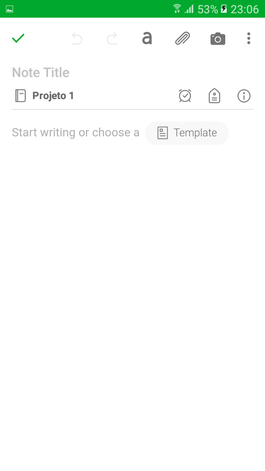
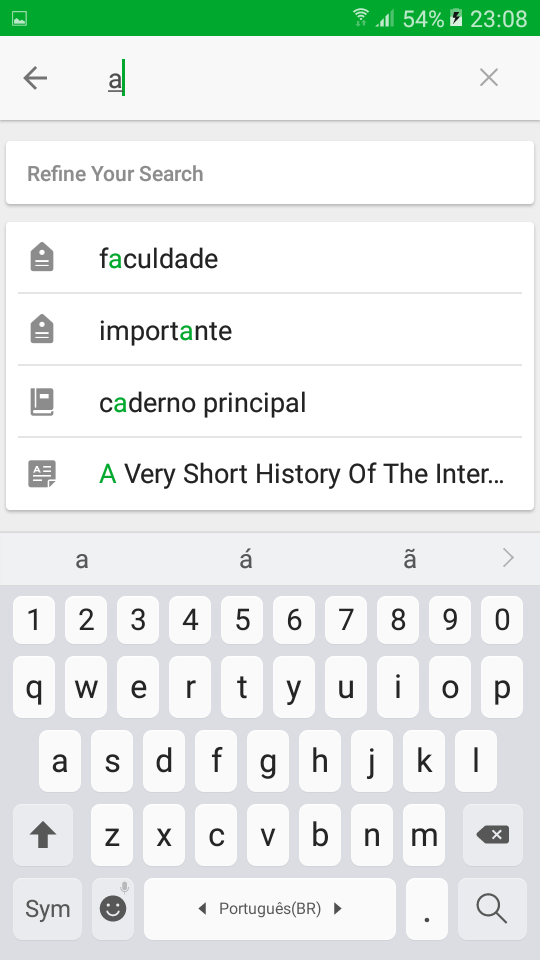
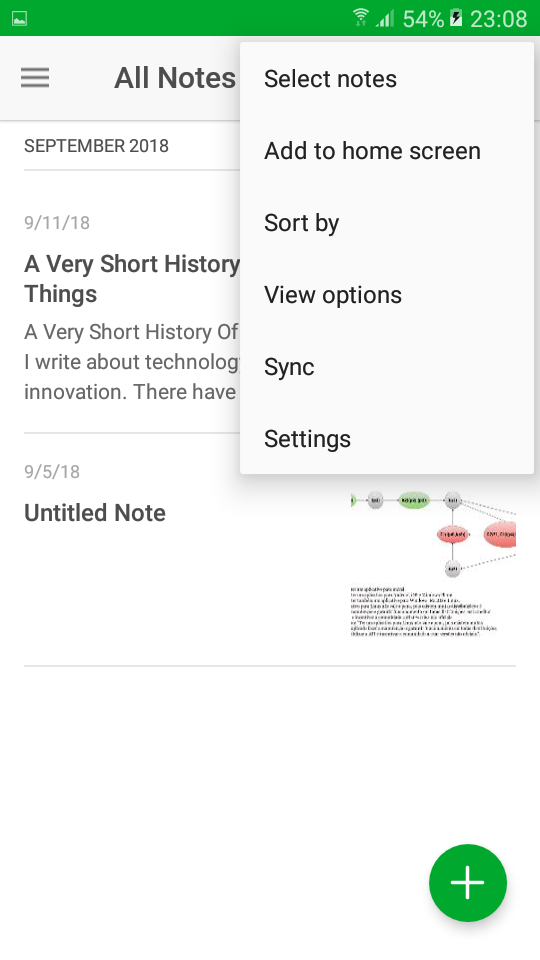
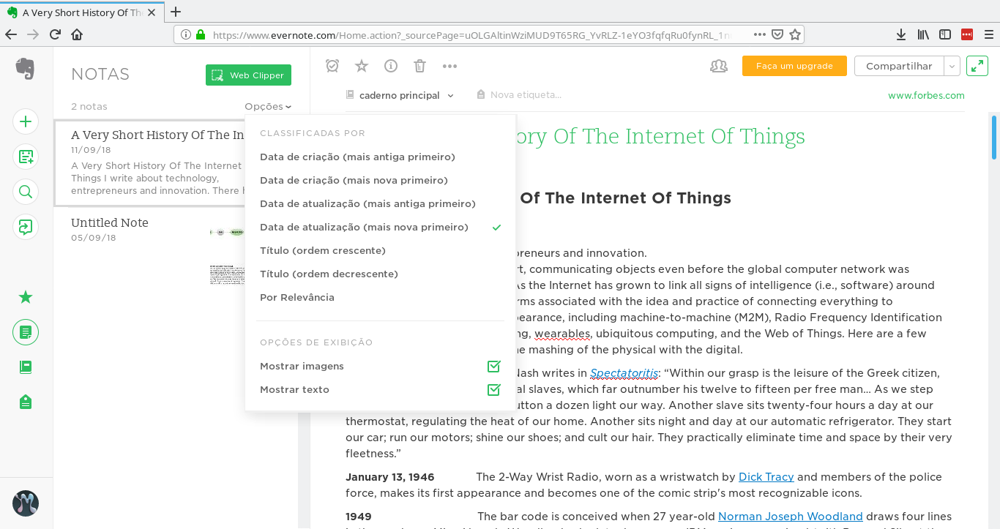
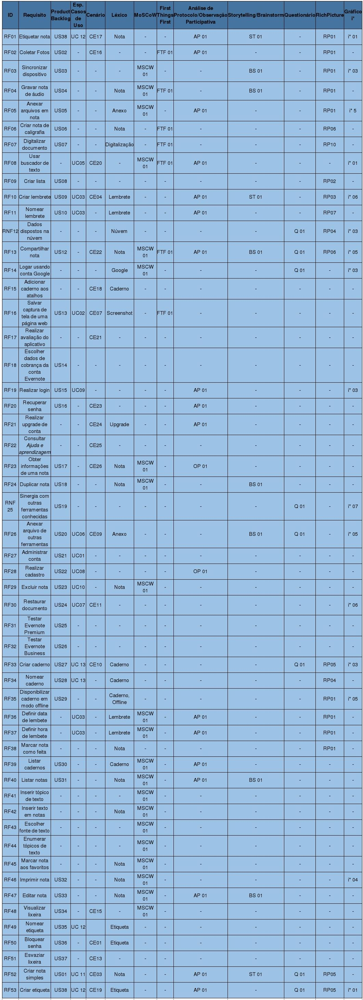

#Matrizes de Rastreabilidade-Versões

## Forward-To

#### Versão 1.0

#### Versão 1.1

## Forward-From 

#### Versão 1.0
 | [app](https://requisitos-2018-2-evernote.github.io/Evernote/Modelagem/#aplicacao) | Web | Rastros|
|--|--|--|
|  |  | |
 |  |  | |
 |  |  | |
 |  |  | |
 | |  | |
 | |  | |
 |    |  | |
 |  |  | |
 |  |  | |
 |  |  | |
 |  |  | |
 |  |  | |

## Backward-From Funcional 

#### Versão 1.0

#### Versão 1.1

#### Versão 2.0

| ID     | Requisito                                    | Product Backlog | Esp. Casos de  Uso                  | Cenário | Léxico             | MoSCoW | First Things First | Análise de Protocolo/Observação Participativa | Storytelling/Brainstorm | Questionário | RichPicture                   | Gráfico i*                                                                             | 
|--------|----------------------------------------------|-----------------|-------------------------------------|---------|--------------------|--------|--------------------|-----------------------------------------------|-------------------------|--------------|-------------------------------|----------------------------------------------------------------------------------------| 
| RF01   | Etiquetar [nota](https://requisitos-2018-2-evernote.github.io/Evernote/Modelagem/#nota)                               | US38            | UC 12 - Criar [etiqueta](https://requisitos-2018-2-evernote.github.io/Evernote/Modelagem/#etiqueta)              | CE17    | [Nota](https://requisitos-2018-2-evernote.github.io/Evernote/Modelagem/#nota)               | -      | -                  | Análise de Protocolo                          | Storytelling            | -            | RP01 - Visão geral|versão 1.0 | [i* [Nota](https://requisitos-2018-2-evernote.github.io/Evernote/Modelagem/#nota)] Task - Adicionar [Etiqueta](https://requisitos-2018-2-evernote.github.io/Evernote/Modelagem/#etiqueta)                                                    | 
| RF02   | Coletar Fotos                                | US02            | -                                   | CE16    | -                  | -      | First Things First | Análise de Protocolo                          | -                       | -            | RP01 - Visão geral|versão 1.0 | -                                                                                      | 
| RF03   | Sincronizar dispositivo                      | US03            | -                                   | -       | -                  | MoSCoW | -                  | -                                             | Brainstorm              | -            | RP01 - Visão geral|versão 1.0 | [i* Sincronia de dados] Task - Solicitar sincronização                                 | 
| RF04   | Gravar [nota](https://requisitos-2018-2-evernote.github.io/Evernote/Modelagem/#nota) de áudio                         | US04            | -                                   | -       | [Nota](https://requisitos-2018-2-evernote.github.io/Evernote/Modelagem/#nota)               | MoSCoW | First Things First | -                                             | Brainstorm              | -            | RP01 - Visão geral|versão 1.0 | -                                                                                      | 
| RF05   | Anexar arquivos em [nota](https://requisitos-2018-2-evernote.github.io/Evernote/Modelagem/#nota)                      | US05            | -                                   | -       | [Anexo](https://requisitos-2018-2-evernote.github.io/Evernote/Modelagem/#anexo)              | MoSCoW | -                  | Análise de Protocolo                          | -                       | -            | RP01 - Visão geral|versão 1.0 | [i* Usuário/Nota] Task - Adicionar [anexo](https://requisitos-2018-2-evernote.github.io/Evernote/Modelagem/#anexo)                                               | 
| RF06   | Criar [nota](https://requisitos-2018-2-evernote.github.io/Evernote/Modelagem/#nota) de caligrafia                     | US06            | -                                   | -       | [Nota](https://requisitos-2018-2-evernote.github.io/Evernote/Modelagem/#nota)               | -      | First Things First | -                                             | -                       | -            | RP06 - Visão geral|versão 1.0 | -                                                                                      | 
| RF07   | Digitalizar documento                        | US07            | -                                   | -       | Digitalização      | -      | First Things First | -                                             | -                       | -            | RP10 - Pequenas Empresas      | -                                                                                      | 
| RF08   | Usar buscador de texto                       | -               | UC05 - Pesquisar [nota](https://requisitos-2018-2-evernote.github.io/Evernote/Modelagem/#nota)               | CE20    | -                  | MoSCoW | First Things First | Análise de Protocolo                          | -                       | -            | -                             | [i* Usuário/Nota] Task - Pesquisar na [nota](https://requisitos-2018-2-evernote.github.io/Evernote/Modelagem/#nota)                                             | 
| RF09   | Criar lista                                  | US08            | -                                   | -       | -                  | -      | -                  | -                                             | -                       | -            | RP02 - Visão geral            | -                                                                                      | 
| RF10   | Criar [lembrete](https://requisitos-2018-2-evernote.github.io/Evernote/Modelagem/#lembrete)                               | US09            | UC03 - Criar [Lembrete](https://requisitos-2018-2-evernote.github.io/Evernote/Modelagem/#lembrete)               | CE04    | [Lembrete](https://requisitos-2018-2-evernote.github.io/Evernote/Modelagem/#lembrete)           | -      | -                  | Análise de Protocolo                          | Storytelling            | -            | RP03 - Visão geral            | [i* Geral] Task - Criar [lembrete](https://requisitos-2018-2-evernote.github.io/Evernote/Modelagem/#lembrete)                                                       | 
| RF11   | Nomear [lembrete](https://requisitos-2018-2-evernote.github.io/Evernote/Modelagem/#lembrete)                              | US10            | UC03 - Criar [Lembrete](https://requisitos-2018-2-evernote.github.io/Evernote/Modelagem/#lembrete)               | -       | [Lembrete](https://requisitos-2018-2-evernote.github.io/Evernote/Modelagem/#lembrete)           | -      | -                  | Análise de Protocolo                          | -                       | -            | RP07 - Visão geral            | -                                                                                      | 
| RNF12  | Dados dispostos na núvem                     | -               | -                                   | -       | Núvem              | -      | -                  | -                                             | -                       | Questionário | RP04 - Visão geral            | [i* Armazenar em núvem] Actor - Google Cloud Platform                                  | 
| RF13   | [Compartilhar](https://requisitos-2018-2-evernote.github.io/Evernote/Modelagem/#compartilhar) [nota](https://requisitos-2018-2-evernote.github.io/Evernote/Modelagem/#nota)                            | US12            | -                                   | CE22    | [Nota](https://requisitos-2018-2-evernote.github.io/Evernote/Modelagem/#nota)               | MoSCoW | First Things First | Análise de Protocolo                          | Brainstorm              | Questionário | RP06 - Visão geral            | [i* [Nota](https://requisitos-2018-2-evernote.github.io/Evernote/Modelagem/#nota)] Hardgoal - Compartilhamento seja realizado                                   | 
| RF14   | Logar usando conta Google                    | -               | -                                   | -       | Google             | MoSCoW | -                  | -                                             | -                       | Questionário | -                             | [i* Geral] Actor - Google / Resource - Login via Google                                | 
| RF15   | Adicionar [caderno](https://requisitos-2018-2-evernote.github.io/Evernote/Modelagem/#caderno) aos atalhos                | -               | -                                   | CE18    | [Caderno](https://requisitos-2018-2-evernote.github.io/Evernote/Modelagem/#caderno)            | -      | -                  | -                                             | -                       | -            | -                             | -                                                                                      | 
| RF16   | Salvar [Captura](https://requisitos-2018-2-evernote.github.io/Evernote/Modelagem/#captura) de tela de uma página web     | US13            | UC02 - [Evernote Web Clipper](https://requisitos-2018-2-evernote.github.io/Evernote/Modelagem/#evernote-web-clipper)         | CE07    | Screenshot         | -      | First Things First | -                                             | -                       | -            | -                             | -                                                                                      | 
| RF17   | Realizar avaliação do [aplicativo](https://requisitos-2018-2-evernote.github.io/Evernote/Modelagem/#aplicacao)             | -               | -                                   | CE21    | -                  | -      | -                  | -                                             | -                       | -            | -                             | -                                                                                      | 
| RF18   | Escolher dados de cobrança da conta Evernote | US14            | -                                   | -       | -                  | -      | -                  | -                                             | -                       | -            | -                             | -                                                                                      | 
| RF19   | Realizar login                               | US15            | UC09 - Evetuar login de [usuário](https://requisitos-2018-2-evernote.github.io/Evernote/Modelagem/#usuario)     | -       | -                  | -      | -                  | Análise de Protocolo                          | -                       | -            | -                             | [i* Login] Task -Efetuar login                                                         | 
| RF20   | Recuperar [senha](https://requisitos-2018-2-evernote.github.io/Evernote/Modelagem/#codigo-de-acesso)                              | US16            | -                                   | CE23    | -                  | -      | -                  | Análise de Protocolo                          | -                       | -            | -                             | -                                                                                      | 
| RF21   | Realizar upgrade de conta                    | -               | -                                   | CE24    | Upgrade            | -      | -                  | Análise de Protocolo                          | -                       | -            | -                             | -                                                                                      | 
| RF22   | Consultar Ajuda e aprendizagem               | -               | -                                   | CE25    | -                  | -      | -                  | -                                             | -                       | -            | -                             | -                                                                                      | 
| RF23   | Obter informações de uma [nota](https://requisitos-2018-2-evernote.github.io/Evernote/Modelagem/#nota)                | US17            | -                                   | CE26    | [Nota](https://requisitos-2018-2-evernote.github.io/Evernote/Modelagem/#nota)               | MoSCoW | -                  | Observação Participativa                      | -                       | -            | -                             | -                                                                                      | 
| RF24   | Duplicar [nota](https://requisitos-2018-2-evernote.github.io/Evernote/Modelagem/#nota)                                | US18            | -                                   | -       | [Nota](https://requisitos-2018-2-evernote.github.io/Evernote/Modelagem/#nota)               | MoSCoW | -                  | -                                             | Brainstorm              | -            | -                             | -                                                                                      | 
| RNF 25 | Sinergia com outras ferramentas conhecidas   | US19            | -                                   | -       | -                  | -      | -                  | -                                             | -                       | Questionário | -                             | [i* Particularidades da versão Premium] Softgoal - Boa sinergia com outras ferramentas | 
| RF26   | Anexar arquivo de outras ferramentas         | US20            | UC06 - Exportar arquivo             | CE09    | [Anexo](https://requisitos-2018-2-evernote.github.io/Evernote/Modelagem/#anexo)              | -      | -                  | -                                             | Brainstorm              | Questionário | -                             | [i* [Nota](https://requisitos-2018-2-evernote.github.io/Evernote/Modelagem/#nota)] Task - Adicionar [Anexo](https://requisitos-2018-2-evernote.github.io/Evernote/Modelagem/#anexo)                                                       | 
| RF27   | Administrar conta                            | US21            | UC01 -Administrar bloqueio de [senha](https://requisitos-2018-2-evernote.github.io/Evernote/Modelagem/#codigo-de-acesso) | -       | -                  | -      | -                  | -                                             | -                       | -            | -                             | -                                                                                      | 
| RF28   | Realizar cadastro                            | US22            | UC08 - Efetuar Cadastrar            | -       | -                  | -      | -                  | Observação Participativa                      | -                       | -            | -                             | -                                                                                      | 
| RF29   | Excluir [nota](https://requisitos-2018-2-evernote.github.io/Evernote/Modelagem/#nota)                                 | US23            | UC10 - Mover para lixeira           | -       | [Nota](https://requisitos-2018-2-evernote.github.io/Evernote/Modelagem/#nota)               | MoSCoW | -                  | -                                             | -                       | -            | -                             | -                                                                                      | 
| RF30   | Restaurar documento                          | US24            | UC07 - Restaurar [nota](https://requisitos-2018-2-evernote.github.io/Evernote/Modelagem/#nota)               | CE11    | -                  | -      | -                  | -                                             | -                       | -            | -                             | [i* Restaurar [nota](https://requisitos-2018-2-evernote.github.io/Evernote/Modelagem/#nota)] Hardgoal - [Nota](https://requisitos-2018-2-evernote.github.io/Evernote/Modelagem/#nota) seja restaurada                                    | 
| RF31   | Testar Evernote Premium                      | US25            | -                                   | -       | -                  | -      | -                  | -                                             | -                       | -            | -                             | -                                                                                      | 
| RF32   | Testar Evernote Business                     | US26            | -                                   | -       | -                  | -      | -                  | -                                             | -                       | -            | -                             | -                                                                                      | 
| RF33   | Criar [caderno](https://requisitos-2018-2-evernote.github.io/Evernote/Modelagem/#caderno)                                | US27            | UC 13 - Criar [Caderno](https://requisitos-2018-2-evernote.github.io/Evernote/Modelagem/#caderno)               | CE10    | [Caderno](https://requisitos-2018-2-evernote.github.io/Evernote/Modelagem/#caderno)            | -      | -                  | -                                             | -                       | Questionário | RP05 - Visão geral            | [i* Geral] Task - Criar [caderno](https://requisitos-2018-2-evernote.github.io/Evernote/Modelagem/#caderno)                                                        | 
| RF34   | Nomear [caderno](https://requisitos-2018-2-evernote.github.io/Evernote/Modelagem/#caderno)                               | US28            | UC 13 - Criar [Caderno](https://requisitos-2018-2-evernote.github.io/Evernote/Modelagem/#caderno)               | -       | [Caderno](https://requisitos-2018-2-evernote.github.io/Evernote/Modelagem/#caderno)            | -      | -                  | -                                             | -                       | -            | RP04 - Visão geral            | -                                                                                      | 
| RF35   | Disponibilizar [caderno](https://requisitos-2018-2-evernote.github.io/Evernote/Modelagem/#caderno) em modo offline       | US29            | -                                   | -       | "Caderno, Offline" | -      | -                  | -                                             | -                       | -            | RP01 - Visão geral|versão 1.0 | [i* Exportar [nota](https://requisitos-2018-2-evernote.github.io/Evernote/Modelagem/#nota)] Task - Ver documento em modo offline                                | 
| RF36   | Definir data de lembete                      | -               | UC03 - Criar [Lembrete](https://requisitos-2018-2-evernote.github.io/Evernote/Modelagem/#lembrete)               | -       | [Lembrete](https://requisitos-2018-2-evernote.github.io/Evernote/Modelagem/#lembrete)           | MoSCoW | -                  | Análise de Protocolo                          | -                       | -            | RP01 - Visão geral|versão 2.0 | -                                                                                      | 
| RF37   | Definir hora de lembete                      | -               | UC03 - Criar [Lembrete](https://requisitos-2018-2-evernote.github.io/Evernote/Modelagem/#lembrete)               | -       | [Lembrete](https://requisitos-2018-2-evernote.github.io/Evernote/Modelagem/#lembrete)           | MoSCoW | -                  | Análise de Protocolo                          | -                       | -            | RP01 - Visão geral|versão 2.0 | -                                                                                      | 
| RF38   | Marcar [nota](https://requisitos-2018-2-evernote.github.io/Evernote/Modelagem/#nota) como feita                       | -               | -                                   | -       | [Nota](https://requisitos-2018-2-evernote.github.io/Evernote/Modelagem/#nota)               | -      | -                  | -                                             | -                       | -            | RP01 - Visão geral|versão 1.0 | -                                                                                      | 
| RF39   | Listar [cadernos](https://requisitos-2018-2-evernote.github.io/Evernote/Modelagem/#caderno)                              | US30            | -                                   | -       | [Caderno](https://requisitos-2018-2-evernote.github.io/Evernote/Modelagem/#caderno)            | MoSCoW | -                  | Análise de Protocolo                          | -                       | -            | -                             | -                                                                                      | 
| RF40   | Listar [notas](https://requisitos-2018-2-evernote.github.io/Evernote/Modelagem/#nota)                                 | US31            | -                                   | -       | [Nota](https://requisitos-2018-2-evernote.github.io/Evernote/Modelagem/#nota)               | MoSCoW | -                  | Análise de Protocolo                          | Brainstorm              | -            | -                             | -                                                                                      | 
| RF41   | Inserir tópico de texto                      | -               | -                                   | -       | -                  | MoSCoW | -                  | -                                             | -                       | -            | -                             | -                                                                                      | 
| RF42   | Inserir texto em [notas](https://requisitos-2018-2-evernote.github.io/Evernote/Modelagem/#nota)                       | -               | -                                   | -       | [Nota](https://requisitos-2018-2-evernote.github.io/Evernote/Modelagem/#nota)               | MoSCoW | -                  | -                                             | -                       | -            | -                             | -                                                                                      | 
| RF43   | Escolher fonte de texto                      | -               | -                                   | -       | -                  | MoSCoW | -                  | -                                             | -                       | -            | -                             | -                                                                                      | 
| RF44   | Enumerar tópicos de texto                    | -               | -                                   | -       | -                  | MoSCoW | -                  | -                                             | -                       | -            | -                             | -                                                                                      | 
| RF45   | Marcar [nota](https://requisitos-2018-2-evernote.github.io/Evernote/Modelagem/#nota) aos favoritos                    | -               | -                                   | -       | [Nota](https://requisitos-2018-2-evernote.github.io/Evernote/Modelagem/#nota)               | MoSCoW | -                  | -                                             | -                       | -            | -                             | -                                                                                      | 
| RF46   | Imprimir [nota](https://requisitos-2018-2-evernote.github.io/Evernote/Modelagem/#nota)                                | US32            | -                                   | -       | [Nota](https://requisitos-2018-2-evernote.github.io/Evernote/Modelagem/#nota)               | MoSCoW | -                  | -                                             | -                       | -            | -                             | [i* Exportar [nota](https://requisitos-2018-2-evernote.github.io/Evernote/Modelagem/#nota)] Task - imprimir documento                                           | 
| RF47   | Editar [nota](https://requisitos-2018-2-evernote.github.io/Evernote/Modelagem/#nota)                                  | US33            | -                                   | -       | [Nota](https://requisitos-2018-2-evernote.github.io/Evernote/Modelagem/#nota)               | MoSCoW | -                  | Análise de Protocolo                          | Brainstorm              | -            | -                             | -                                                                                      | 
| RF48   | Visualizar lixeira                           | US34            | -                                   | CE15    | -                  | MoSCoW | -                  | -                                             | -                       | -            | -                             | -                                                                                      | 
| RF49   | Nomear [etiqueta](https://requisitos-2018-2-evernote.github.io/Evernote/Modelagem/#etiqueta)                              | US35            | UC 12 - Criar [etiqueta](https://requisitos-2018-2-evernote.github.io/Evernote/Modelagem/#etiqueta)              |         | [Etiqueta](https://requisitos-2018-2-evernote.github.io/Evernote/Modelagem/#etiqueta)           | -      | -                  | -                                             | -                       | -            | -                             | -                                                                                      | 
| RF50   | Bloquear [senha](https://requisitos-2018-2-evernote.github.io/Evernote/Modelagem/#codigo-de-acesso)                               | US36            | -                                   | CE01    | [Etiqueta](https://requisitos-2018-2-evernote.github.io/Evernote/Modelagem/#etiqueta)           | -      | -                  | -                                             | -                       | -            | -                             | -                                                                                      | 
| RF51   | Esvaziar lixeira                             | US37            | -                                   | CE13    | -                  | -      | -                  | -                                             | -                       | -            | -                             | -                                                                                      | 
| RF52   | Criar [nota](https://requisitos-2018-2-evernote.github.io/Evernote/Modelagem/#nota) simples                           | US01            | UC 11 - Criar [nota](https://requisitos-2018-2-evernote.github.io/Evernote/Modelagem/#nota)                  | CE03    | [Nota](https://requisitos-2018-2-evernote.github.io/Evernote/Modelagem/#nota)               | -      | -                  | Análise de Protocolo                          | Storytelling            | Questionário | RP05 - Visão geral            | -                                                                                      | 
| RF53   | Criar [etiqueta](https://requisitos-2018-2-evernote.github.io/Evernote/Modelagem/#etiqueta)                               | US38            | UC 12 - Criar [etiqueta](https://requisitos-2018-2-evernote.github.io/Evernote/Modelagem/#etiqueta)              | CE19    | [Etiqueta](https://requisitos-2018-2-evernote.github.io/Evernote/Modelagem/#etiqueta)           | -      | -                  | Análise de Protocolo                          | -                       | Questionário | RP05 - Visão geral            | [i* Geral] Task - Criar [etiqueta](https://requisitos-2018-2-evernote.github.io/Evernote/Modelagem/#etiqueta)                                                       |

#### Versão 3.0

| ID     | Requisito                                    | Product Backlog | Esp. Casos de Uso/UML | Cenário | Léxico             | MoSCoW  | First Things First | Análise de Protocolo/Observação Participativa | Storyboard/Brainstorm | Questionário | RichPicture | Gráfico i* | 
|--------|----------------------------------------------|-----------------|--------------------|---------|--------------------|---------|--------------------|-----------------------------------------------|-------------------------|--------------|-------------|------------| 
| [RF41](https://requisitos-2018-2-evernote.github.io/Evernote/Elicitacao/#introspeccao)   | Etiquetar [nota](https://requisitos-2018-2-evernote.github.io/Evernote/Modelagem/#nota)                               |   -          | [UCS04](https://requisitos-2018-2-evernote.github.io/Evernote/Modelagem2/#especificacao-de-casos-de-uso)              | [CE17](https://requisitos-2018-2-evernote.github.io/Evernote/Modelagem/)    | [Nota](https://requisitos-2018-2-evernote.github.io/Evernote/Modelagem/#nota)               | -       | -                  | [AP01](http://127.0.0.1:8000/Elicitacao/#analise-de-protocolo)                                         | [SB01](https://requisitos-2018-2-evernote.github.io/Evernote/Pre-Rastreabilidade/#funcionalidades-e-recursos)                   | -            | [RP09](https://requisitos-2018-2-evernote.github.io/Evernote/Pre-Rastreabilidade/#visao-geral)        | [i*01](https://requisitos-2018-2-evernote.github.io/Evernote/Modelagem4/#geral_1)      | 
| [RF42](https://requisitos-2018-2-evernote.github.io/Evernote/Elicitacao/#introspeccao)   | Coletar Fotos                                |   -          | -                  | [CE16](https://requisitos-2018-2-evernote.github.io/Evernote/Modelagem/)    | -                  | -       | [FTF01](https://requisitos-2018-2-evernote.github.io/Evernote/Elicitacao/#ftf01)             | [AP01](http://127.0.0.1:8000/Elicitacao/#analise-de-protocolo)                                         | -                       | -            | [RP09](http://127.0.0.1:8000/Pre-Rastreabilidade/#funcionalidades-e-recursos)        | -          | 
| [RF02](https://requisitos-2018-2-evernote.github.io/Evernote/Elicitacao/#introspeccao)   | Sincronizar dispositivo                      |  -           | -                  | -       | -                  | [MSCW02](https://requisitos-2018-2-evernote.github.io/Evernote/Elicitacao/#mscw02) | [FTF02](https://requisitos-2018-2-evernote.github.io/Evernote/Elicitacao/#ftf02)                  | -                                             | [BS01](https://requisitos-2018-2-evernote.github.io/Evernote/Elicitacao/#bs01)                   | -            | [RP01](https://requisitos-2018-2-evernote.github.io/Evernote/Pre-Rastreabilidade/#visao-geral)        | [i*03](https://requisitos-2018-2-evernote.github.io/Evernote/Modelagem4/#login)      | 
| [RF35](https://requisitos-2018-2-evernote.github.io/Evernote/Elicitacao/#introspeccao)   | Gravar [nota](https://requisitos-2018-2-evernote.github.io/Evernote/Modelagem/#nota) de áudio                         | -            | -                  | -       | [Nota](https://requisitos-2018-2-evernote.github.io/Evernote/Modelagem/#nota)               | [MSCW02](https://requisitos-2018-2-evernote.github.io/Evernote/Elicitacao/#mscw02) | [FTF02](https://requisitos-2018-2-evernote.github.io/Evernote/Elicitacao/#ftf02)             | -                                             | [BS01](https://requisitos-2018-2-evernote.github.io/Evernote/Elicitacao/#bs01)                   | -            | [RP01](https://requisitos-2018-2-evernote.github.io/Evernote/Pre-Rastreabilidade/#visao-geral)        | -          | 
| [RF34](https://requisitos-2018-2-evernote.github.io/Evernote/Elicitacao/#introspeccao)   | Anexar arquivos em [nota](https://requisitos-2018-2-evernote.github.io/Evernote/Modelagem/#nota)                      | [US22](https://requisitos-2018-2-evernote.github.io/Evernote/Modelagem3/#product-backlog)            | -                  | -       | [Anexo](https://requisitos-2018-2-evernote.github.io/Evernote/Modelagem/#anexo)              | [MSCW02](https://requisitos-2018-2-evernote.github.io/Evernote/Elicitacao/#mscw02) | [FTF02](https://requisitos-2018-2-evernote.github.io/Evernote/Elicitacao/#ftf02)                  | [AP01](http://127.0.0.1:8000/Elicitacao/#analise-de-protocolo)                                         | [BS01](https://requisitos-2018-2-evernote.github.io/Evernote/Elicitacao/#bs01)                       | -            | [RP01](https://requisitos-2018-2-evernote.github.io/Evernote/Pre-Rastreabilidade/#visao-geral)        | [i*05](https://requisitos-2018-2-evernote.github.io/Evernote/Modelagem4/#restaurar-nota)       | 
| [RF43](https://requisitos-2018-2-evernote.github.io/Evernote/Elicitacao/#introspeccao)  | Criar [nota](https://requisitos-2018-2-evernote.github.io/Evernote/Modelagem/#nota) de caligrafia                     | -            | -                  | -       | [Nota](https://requisitos-2018-2-evernote.github.io/Evernote/Modelagem/#nota)               | -       | [FTF01](https://requisitos-2018-2-evernote.github.io/Evernote/Elicitacao/#ftf01)             | -                                             | -                       | -            | [RP06](https://requisitos-2018-2-evernote.github.io/Evernote/Pre-Rastreabilidade/#fluxo-de-trabalho)        | -          | 
| [RF44](https://requisitos-2018-2-evernote.github.io/Evernote/Elicitacao/#introspeccao)   | Digitalizar documento                        |   -          | -                  | -       | [Digitalização](https://requisitos-2018-2-evernote.github.io/Evernote/Modelagem/#digitalizacao)      | -       | [FTF01](https://requisitos-2018-2-evernote.github.io/Evernote/Elicitacao/#ftf01)             | -                                             | -                       | -            | [RP04](https://requisitos-2018-2-evernote.github.io/Evernote/Pre-Rastreabilidade/#pequenas-empresas)        | -          | 
| [RF45](https://requisitos-2018-2-evernote.github.io/Evernote/Elicitacao/#introspeccao)   | Usar buscador de texto                       | [US23](https://requisitos-2018-2-evernote.github.io/Evernote/Modelagem3/#product-backlog)               | [UC05](https://requisitos-2018-2-evernote.github.io/Evernote/Modelagem2/#casos-de-uso)               | [CE20](https://requisitos-2018-2-evernote.github.io/Evernote/Modelagem/)    | -                  | [MSCW02](https://requisitos-2018-2-evernote.github.io/Evernote/Elicitacao/#mscw02) | [FTF01](https://requisitos-2018-2-evernote.github.io/Evernote/Elicitacao/#ftf01)             | [AP01](http://127.0.0.1:8000/Elicitacao/#analise-de-protocolo)                                         | -                       | -            | -           | [i*01](https://requisitos-2018-2-evernote.github.io/Evernote/Modelagem4/#geral_1)      | 
| [RF46](https://requisitos-2018-2-evernote.github.io/Evernote/Elicitacao/#introspeccao)   | Criar lista                                  | [US08](https://requisitos-2018-2-evernote.github.io/Evernote/Modelagem3/#product-backlog)            | -                  | -       | -                  | -       | -                  | -                                             | [SB05](https://requisitos-2018-2-evernote.github.io/Evernote/Elicitacao/#sb05-lista-de-compras)                       | -            | [RP02](https://requisitos-2018-2-evernote.github.io/Evernote/Pre-Rastreabilidade/#criar-nota)        | -          | 
| [RF47](https://requisitos-2018-2-evernote.github.io/Evernote/Elicitacao/#introspeccao)   | Criar [lembrete](https://requisitos-2018-2-evernote.github.io/Evernote/Modelagem/#lembrete)                               | [US09](https://requisitos-2018-2-evernote.github.io/Evernote/Modelagem3/#product-backlog)            | [UC03](https://requisitos-2018-2-evernote.github.io/Evernote/Modelagem2/)               | [CE04](https://requisitos-2018-2-evernote.github.io/Evernote/Modelagem/)    | [Lembrete](https://requisitos-2018-2-evernote.github.io/Evernote/Modelagem/#lembrete)           | [MSCW01](https://requisitos-2018-2-evernote.github.io/Evernote/Elicitacao/#mscw01)       | -                  | [AP01](http://127.0.0.1:8000/Elicitacao/#analise-de-protocolo)                                         | [SB04](https://requisitos-2018-2-evernote.github.io/Evernote/Elicitacao/#sb04-nota-de-audio)                   | -            | [RP03](https://requisitos-2018-2-evernote.github.io/Evernote/Pre-Rastreabilidade/#visao-de-usuario)        | [i*06](https://requisitos-2018-2-evernote.github.io/Evernote/Modelagem4/#armazenar-em-nuvem)      | 
| [RF48](https://requisitos-2018-2-evernote.github.io/Evernote/Elicitacao/#introspeccao)   | Nomear [lembrete](https://requisitos-2018-2-evernote.github.io/Evernote/Modelagem/#lembrete)                              | [US10](https://requisitos-2018-2-evernote.github.io/Evernote/Modelagem3/#product-backlog)            | [UML03]()               | -       | [Lembrete](https://requisitos-2018-2-evernote.github.io/Evernote/Modelagem/#lembrete)           | -       | -                  | [AP01](http://127.0.0.1:8000/Elicitacao/#analise-de-protocolo)                                         | -                       | -            | [RP01](https://requisitos-2018-2-evernote.github.io/Evernote/Pre-Rastreabilidade/#visao-geral)        | -          | 
| [RNF77](https://requisitos-2018-2-evernote.github.io/Evernote/Elicitacao/#introspeccao)  | Dados dispostos na núvem                     | -               | -                  | -       | [Núvem](https://requisitos-2018-2-evernote.github.io/Evernote/Modelagem/#nuvem)              | -       | -                  | -                                             | -                       | [Q01](https://requisitos-2018-2-evernote.github.io/Evernote/Elicitacao/#entrevista)         | [RP01](https://requisitos-2018-2-evernote.github.io/Evernote/Pre-Rastreabilidade/#visao-geral)        | [i*03](https://requisitos-2018-2-evernote.github.io/Evernote/Modelagem4/#login)      | 
| [RF04](https://requisitos-2018-2-evernote.github.io/Evernote/Elicitacao/#introspeccao)   | [Compartilhar](https://requisitos-2018-2-evernote.github.io/Evernote/Modelagem/#compartilhar) [nota](https://requisitos-2018-2-evernote.github.io/Evernote/Modelagem/#nota)                            | [US24](https://requisitos-2018-2-evernote.github.io/Evernote/Modelagem3/#product-backlog)            | -                  | [CE22](https://requisitos-2018-2-evernote.github.io/Evernote/Modelagem/)    | [Nota](https://requisitos-2018-2-evernote.github.io/Evernote/Modelagem/#nota)               | [MSCW02](https://requisitos-2018-2-evernote.github.io/Evernote/Elicitacao/#mscw02) | [FTF02](https://requisitos-2018-2-evernote.github.io/Evernote/Elicitacao/#ftf02)             | [AP01](http://127.0.0.1:8000/Elicitacao/#analise-de-protocolo)                                         | [BS01](https://requisitos-2018-2-evernote.github.io/Evernote/Elicitacao/#bs01)                   | [Q01](https://requisitos-2018-2-evernote.github.io/Evernote/Elicitacao/#entrevista)         | [RP06](https://requisitos-2018-2-evernote.github.io/Evernote/Pre-Rastreabilidade/#fluxo-de-trabalho)        | [i*05](https://requisitos-2018-2-evernote.github.io/Evernote/Modelagem4/#restaurar-nota)     | 
| [RF49](https://requisitos-2018-2-evernote.github.io/Evernote/Elicitacao/#introspeccao)   | Logar usando conta Google                    | [US05](https://requisitos-2018-2-evernote.github.io/Evernote/Modelagem3/#product-backlog)               | -                  | -       | [Google](https://requisitos-2018-2-evernote.github.io/Evernote/Modelagem/#google)             | [MSCW02](https://requisitos-2018-2-evernote.github.io/Evernote/Elicitacao/#mscw02) | -                  | -                                             | -                       | [Q01](https://requisitos-2018-2-evernote.github.io/Evernote/Elicitacao/#entrevista)         | -           | [i*03](https://requisitos-2018-2-evernote.github.io/Evernote/Modelagem4/#login)      | 
| [RF50](https://requisitos-2018-2-evernote.github.io/Evernote/Elicitacao/#introspeccao)   | Adicionar [caderno](https://requisitos-2018-2-evernote.github.io/Evernote/Modelagem/#caderno) aos atalhos                | -               | -                  | [CE18](https://requisitos-2018-2-evernote.github.io/Evernote/Modelagem/)    | [Caderno](https://requisitos-2018-2-evernote.github.io/Evernote/Modelagem/#caderno)            | -       | -                  | -                                             | -                       | -            | -           | -          | 
| [RF51](https://requisitos-2018-2-evernote.github.io/Evernote/Elicitacao/#introspeccao)   | Salvar [Captura](https://requisitos-2018-2-evernote.github.io/Evernote/Modelagem/#captura) de tela de uma página web     | [US13](https://requisitos-2018-2-evernote.github.io/Evernote/Modelagem3/#product-backlog)            | [UC02](https://requisitos-2018-2-evernote.github.io/Evernote/Modelagem2/)               | [CE07](https://requisitos-2018-2-evernote.github.io/Evernote/Modelagem/)    | [Captura](https://requisitos-2018-2-evernote.github.io/Evernote/Modelagem/#captura)         | -       | [FTF01](https://requisitos-2018-2-evernote.github.io/Evernote/Elicitacao/#ftf01)             | -                                             | -                       | -            | -           | -          | 
| [RF52](https://requisitos-2018-2-evernote.github.io/Evernote/Elicitacao/#introspeccao)   | Realizar avaliação do [aplicativo](https://requisitos-2018-2-evernote.github.io/Evernote/Modelagem/#aplicacao)             | -               | -                  | [CE21](https://requisitos-2018-2-evernote.github.io/Evernote/Modelagem/)    | -                  | -       | -                  | -                                             | -                       | -            | -           | -          | 
| [RF53](https://requisitos-2018-2-evernote.github.io/Evernote/Elicitacao/#introspeccao)   | Escolher dados de cobrança da conta Evernote |  -           | -                  | -       | -                  | [MSCW02](https://requisitos-2018-2-evernote.github.io/Evernote/Elicitacao/#mscw02)       | -                  | -                                             | -                       | -            | -           | -          | 
| [RF54](https://requisitos-2018-2-evernote.github.io/Evernote/Elicitacao/#introspeccao)   | Realizar login                               |   -          | [UC09](https://requisitos-2018-2-evernote.github.io/Evernote/Modelagem2/)               | -       | -                  | -       | -                  | [AP01](http://127.0.0.1:8000/Elicitacao/#analise-de-protocolo)                                         | -                       | -            | -           | [i*03](https://requisitos-2018-2-evernote.github.io/Evernote/Modelagem4/#login)      | 
| [RF55](https://requisitos-2018-2-evernote.github.io/Evernote/Elicitacao/#introspeccao)   | Recuperar [senha](https://requisitos-2018-2-evernote.github.io/Evernote/Modelagem/#codigo-de-acesso)                              |    -         | -                  | [CE23](https://requisitos-2018-2-evernote.github.io/Evernote/Modelagem/)    | -                  | -       | -                  | [AP01](http://127.0.0.1:8000/Elicitacao/#analise-de-protocolo)                                         | -                       | -            | -           | -          | 
| [RF56](https://requisitos-2018-2-evernote.github.io/Evernote/Elicitacao/#introspeccao)   | Realizar upgrade de conta                    | [US10](https://requisitos-2018-2-evernote.github.io/Evernote/Modelagem3/#product-backlog)               | [UCS06](https://requisitos-2018-2-evernote.github.io/Evernote/Modelagem2/#especificacao-de-casos-de-uso)                  | [CE24](https://requisitos-2018-2-evernote.github.io/Evernote/Modelagem/)    | [Upgrade](https://requisitos-2018-2-evernote.github.io/Evernote/Modelagem/#upgrade)            | -       | -                  | [AP01](http://127.0.0.1:8000/Elicitacao/#analise-de-protocolo)                                         | -                       | -            | -           | -          | 
| [RF57](https://requisitos-2018-2-evernote.github.io/Evernote/Elicitacao/#introspeccao)   | Consultar Ajuda e aprendizagem               | -               | -                  | [CE25](https://requisitos-2018-2-evernote.github.io/Evernote/Modelagem/)    | -                  | -       | -                  | -                                             | -                       | -            | -           | -          | 
| [RF13](https://requisitos-2018-2-evernote.github.io/Evernote/Elicitacao/#introspeccao)   | Obter informações de uma [nota](https://requisitos-2018-2-evernote.github.io/Evernote/Modelagem/#nota)                | [US25](https://requisitos-2018-2-evernote.github.io/Evernote/Modelagem3/#product-backlog)            | -                  | [CE26](https://requisitos-2018-2-evernote.github.io/Evernote/Modelagem/)    | [Nota](https://requisitos-2018-2-evernote.github.io/Evernote/Modelagem/#nota)               | [MSCW02](https://requisitos-2018-2-evernote.github.io/Evernote/Elicitacao/#mscw02) | [FTF02](https://requisitos-2018-2-evernote.github.io/Evernote/Elicitacao/#ftf02)                  |    -                                      | -                       | -            | -           | -          | 
| [RF39](https://requisitos-2018-2-evernote.github.io/Evernote/Elicitacao/#introspeccao)   | Duplicar [nota](https://requisitos-2018-2-evernote.github.io/Evernote/Modelagem/#nota)                                | [US19](https://requisitos-2018-2-evernote.github.io/Evernote/Modelagem3/#product-backlog)            | -                  | -       | [Nota](https://requisitos-2018-2-evernote.github.io/Evernote/Modelagem/#nota)               | [MSCW02](https://requisitos-2018-2-evernote.github.io/Evernote/Elicitacao/#mscw02) | [FTF02](https://requisitos-2018-2-evernote.github.io/Evernote/Elicitacao/#ftf02)                  | -                                             | [BS01](https://requisitos-2018-2-evernote.github.io/Evernote/Elicitacao/#bs01)                   | -            | -           | -          | 
| [RNF76](https://requisitos-2018-2-evernote.github.io/Evernote/Elicitacao/#introspeccao) | Sinergia com outras ferramentas conhecidas   |  -           | -                  | -       | -                  | -       | -                  | -                                             | -                       | [Q01](https://requisitos-2018-2-evernote.github.io/Evernote/Elicitacao/#entrevista)         | -           | [i*07](https://requisitos-2018-2-evernote.github.io/Evernote/Modelagem4/#armazenar-em-disco-local)      | 
| [RF58](https://requisitos-2018-2-evernote.github.io/Evernote/Elicitacao/#introspeccao)   | Anexar arquivo de outras ferramentas         |  -           | [UC06](https://requisitos-2018-2-evernote.github.io/Evernote/Modelagem2/)               | [CE09](https://requisitos-2018-2-evernote.github.io/Evernote/Modelagem/)    | [Anexo](https://requisitos-2018-2-evernote.github.io/Evernote/Modelagem/#anexo)              | -       | -                  | -                                             |            -        | [Q01](https://requisitos-2018-2-evernote.github.io/Evernote/Elicitacao/#entrevista)         | -           | [i*05](https://requisitos-2018-2-evernote.github.io/Evernote/Modelagem4/#restaurar-nota)      | 
| [RF59](https://requisitos-2018-2-evernote.github.io/Evernote/Elicitacao/#introspeccao)   | Administrar conta                            | [US06](https://requisitos-2018-2-evernote.github.io/Evernote/Modelagem3/#product-backlog)            | [UC01](https://requisitos-2018-2-evernote.github.io/Evernote/Modelagem2/)               | -       | -                  | -       | -                  | -                                             | -                       | -            | -           | -          | 
| [RF60](https://requisitos-2018-2-evernote.github.io/Evernote/Elicitacao/#introspeccao)   | Realizar cadastro                            | [US01](https://requisitos-2018-2-evernote.github.io/Evernote/Modelagem3/#us01-fazer-cadastro-no-aplicativo)            | [UC08](https://requisitos-2018-2-evernote.github.io/Evernote/Modelagem2/)               | -       | -                  | -       | -                  | -                                         | -                       | -            | -           | -          | 
| [RF08](https://requisitos-2018-2-evernote.github.io/Evernote/Elicitacao/#introspeccao)   | Excluir [nota](https://requisitos-2018-2-evernote.github.io/Evernote/Modelagem/#nota)                                 | [US16](https://requisitos-2018-2-evernote.github.io/Evernote/Modelagem3/#product-backlog)            | -               | -       | [Nota](https://requisitos-2018-2-evernote.github.io/Evernote/Modelagem/#nota)               | [MSCW02](https://requisitos-2018-2-evernote.github.io/Evernote/Elicitacao/#mscw02) | [FTF02](https://requisitos-2018-2-evernote.github.io/Evernote/Elicitacao/#ftf02)                  | -                                             | -                       | -            | -           | -          | 
| [RF61](https://requisitos-2018-2-evernote.github.io/Evernote/Elicitacao/#introspeccao)  | Restaurar documento                          | [US18](https://requisitos-2018-2-evernote.github.io/Evernote/Modelagem3/#product-backlog)            | [UC07](https://requisitos-2018-2-evernote.github.io/Evernote/Modelagem2/)               | [CE11](https://requisitos-2018-2-evernote.github.io/Evernote/Modelagem/)    | -                  | -       | -                  | -                                             | -                       | -            | -           | [i*06](https://requisitos-2018-2-evernote.github.io/Evernote/Modelagem4/#armazenar-em-nuvem)      | 
| [RF62](https://requisitos-2018-2-evernote.github.io/Evernote/Elicitacao/#introspeccao)   | Testar Evernote Premium                      |   -          | -                  | -       | -                  | -       | -                  | -                                             | -                       | -            | -           | [i*11](https://requisitos-2018-2-evernote.github.io/Evernote/Modelagem4/#particularidades-da-versao-premium)          | 
| [RF63](https://requisitos-2018-2-evernote.github.io/Evernote/Elicitacao/#introspeccao)   | Testar Evernote Business                     |  -           | -                  | -       | -                  | -       | -                  | -                                             | -                       | -            | -           | [i*11](https://requisitos-2018-2-evernote.github.io/Evernote/Modelagem4/#particularidades-da-versao-premium)          | 
| [RF64](https://requisitos-2018-2-evernote.github.io/Evernote/Elicitacao/#introspeccao)   | Criar [caderno](https://requisitos-2018-2-evernote.github.io/Evernote/Modelagem/#caderno)                                | [US27](https://requisitos-2018-2-evernote.github.io/Evernote/Modelagem3/#product-backlog)            | [UCS2](https://requisitos-2018-2-evernote.github.io/Evernote/Modelagem2/#especificacao-de-casos-de-uso)              | [CE10](https://requisitos-2018-2-evernote.github.io/Evernote/Modelagem/)    | [Caderno](https://requisitos-2018-2-evernote.github.io/Evernote/Modelagem/#caderno)            | -       | -                  | -                                             | -                       | [Q01](https://requisitos-2018-2-evernote.github.io/Evernote/Elicitacao/#entrevista)         | -        | [i*03](https://requisitos-2018-2-evernote.github.io/Evernote/Modelagem4/#login)      | 
| [RF65](https://requisitos-2018-2-evernote.github.io/Evernote/Elicitacao/#introspeccao)   | Nomear [caderno](https://requisitos-2018-2-evernote.github.io/Evernote/Modelagem/#caderno)                               | [US28](https://requisitos-2018-2-evernote.github.io/Evernote/Modelagem3/#product-backlog)            | -              | -       | [Caderno](https://requisitos-2018-2-evernote.github.io/Evernote/Modelagem/#caderno)            | -       | -                  | -                                             | -                       | -            | -        | -          | 
| [RF66](https://requisitos-2018-2-evernote.github.io/Evernote/Elicitacao/#introspeccao)   | Disponibilizar [caderno](https://requisitos-2018-2-evernote.github.io/Evernote/Modelagem/#caderno) em modo offline       |   -          | -                  | -       | [Caderno](https://requisitos-2018-2-evernote.github.io/Evernote/Modelagem/#caderno), [Offline](https://requisitos-2018-2-evernote.github.io/Evernote/Modelagem/#offline) | [MSCW01](https://requisitos-2018-2-evernote.github.io/Evernote/Elicitacao/#mscw01)       | -                  | -                                             | -                       | -            | [RP01](https://requisitos-2018-2-evernote.github.io/Evernote/Pre-Rastreabilidade/#visao-geral)        | [i*05](https://requisitos-2018-2-evernote.github.io/Evernote/Modelagem4/#restaurar-nota)      | 
| [RF40](https://requisitos-2018-2-evernote.github.io/Evernote/Elicitacao/#introspeccao)   | Definir data de [lembrete](https://requisitos-2018-2-evernote.github.io/Evernote/Modelagem/#lembrete)                      | -               | [UML03](https://requisitos-2018-2-evernote.github.io/Evernote/Modelagem2/#criar-lembrete-v11)               | -       | [Lembrete](https://requisitos-2018-2-evernote.github.io/Evernote/Modelagem/#lembrete)           | [MSCW02](https://requisitos-2018-2-evernote.github.io/Evernote/Elicitacao/#mscw02) | [FTF02](https://requisitos-2018-2-evernote.github.io/Evernote/Elicitacao/#ftf02)                  | [AP01](http://127.0.0.1:8000/Elicitacao/#analise-de-protocolo)                                         | -                       | -            | [RP01](https://requisitos-2018-2-evernote.github.io/Evernote/Pre-Rastreabilidade/#visao-geral)        | -          | 
| [RF16](https://requisitos-2018-2-evernote.github.io/Evernote/Elicitacao/#introspeccao)   | Definir hora de lembete                      | -               | [UML03](https://requisitos-2018-2-evernote.github.io/Evernote/Modelagem2/#criar-lembrete-v11)               | -       | [Lembrete](https://requisitos-2018-2-evernote.github.io/Evernote/Modelagem/#lembrete)           | [MSCW02](https://requisitos-2018-2-evernote.github.io/Evernote/Elicitacao/#mscw02) | [FTF02](https://requisitos-2018-2-evernote.github.io/Evernote/Elicitacao/#ftf02)                  | [AP01](http://127.0.0.1:8000/Elicitacao/#analise-de-protocolo)                                         | -                       | -            | [RP01](https://requisitos-2018-2-evernote.github.io/Evernote/Pre-Rastreabilidade/#visao-geral)        | -          | 
| [RF67](https://requisitos-2018-2-evernote.github.io/Evernote/Elicitacao/#introspeccao)   | Marcar [nota](https://requisitos-2018-2-evernote.github.io/Evernote/Modelagem/#nota) como feita                       | -               | -                  | -       | [Nota](https://requisitos-2018-2-evernote.github.io/Evernote/Modelagem/#nota)               | -       | -                  | -                                             | -                       | -            | [RP01](https://requisitos-2018-2-evernote.github.io/Evernote/Pre-Rastreabilidade/#visao-geral)        | -          | 
| [RF68](https://requisitos-2018-2-evernote.github.io/Evernote/Elicitacao/#introspeccao)   | Listar [cadernos](https://requisitos-2018-2-evernote.github.io/Evernote/Modelagem/#caderno)                              | [US30](https://requisitos-2018-2-evernote.github.io/Evernote/Modelagem3/#product-backlog)            | -                  | -       | [Caderno](https://requisitos-2018-2-evernote.github.io/Evernote/Modelagem/#caderno)            | [MSCW02](https://requisitos-2018-2-evernote.github.io/Evernote/Elicitacao/#mscw02) | -                  | [AP01](http://127.0.0.1:8000/Elicitacao/#analise-de-protocolo)                                         | -                       | -            | -           | -          | 
| [RF01](https://requisitos-2018-2-evernote.github.io/Evernote/Elicitacao/#introspeccao)   | Listar [notas](https://requisitos-2018-2-evernote.github.io/Evernote/Modelagem/#nota)                                 |   -          | -                  | -       | [Nota](https://requisitos-2018-2-evernote.github.io/Evernote/Modelagem/#nota)               | [MSCW02](https://requisitos-2018-2-evernote.github.io/Evernote/Elicitacao/#mscw02) | [FTF02](https://requisitos-2018-2-evernote.github.io/Evernote/Elicitacao/#ftf02)                  | [AP01](http://127.0.0.1:8000/Elicitacao/#analise-de-protocolo)                                         | [BS01](https://requisitos-2018-2-evernote.github.io/Evernote/Elicitacao/#bs01)                   | -            | -           | -          | 
| [RF69](https://requisitos-2018-2-evernote.github.io/Evernote/Elicitacao/#introspeccao)   | Inserir tópico de texto                      | -               | -                  | -       | -                  | [MSCW02](https://requisitos-2018-2-evernote.github.io/Evernote/Elicitacao/#mscw02) | -                  | -                                             | -                       | -            | -           | -          | 
| [RF70](https://requisitos-2018-2-evernote.github.io/Evernote/Elicitacao/#introspeccao)   | Inserir texto em [notas](https://requisitos-2018-2-evernote.github.io/Evernote/Modelagem/#nota)                       | -               | -                  | -       | [Nota](https://requisitos-2018-2-evernote.github.io/Evernote/Modelagem/#nota)               | [MSCW02](https://requisitos-2018-2-evernote.github.io/Evernote/Elicitacao/#mscw02) | -                  | -                                             | -                       | -            | -           | -          | 
| [RF18](https://requisitos-2018-2-evernote.github.io/Evernote/Elicitacao/#introspeccao)   | Escolher fonte de texto                      | [US21](https://requisitos-2018-2-evernote.github.io/Evernote/Modelagem3/#product-backlog)               | -                  | -       | -                  | [MSCW02](https://requisitos-2018-2-evernote.github.io/Evernote/Elicitacao/#mscw02) | -                  | -                                             | -                       | -            | -           | -          | 
| [RF28](https://requisitos-2018-2-evernote.github.io/Evernote/Elicitacao/#introspeccao)   | Enumerar tópicos de texto                    | -               | -                  | -       | -                  | [MSCW02](https://requisitos-2018-2-evernote.github.io/Evernote/Elicitacao/#mscw02) | -                  | -                                             | -                       | -            | -           | -          | 
| [RF05](https://requisitos-2018-2-evernote.github.io/Evernote/Elicitacao/#introspeccao)   | Marcar [nota](https://requisitos-2018-2-evernote.github.io/Evernote/Modelagem/#nota) aos favoritos                    | -               | -                  | -       | [Nota](https://requisitos-2018-2-evernote.github.io/Evernote/Modelagem/#nota)               | [MSCW02](https://requisitos-2018-2-evernote.github.io/Evernote/Elicitacao/#mscw02) | [FTF02](https://requisitos-2018-2-evernote.github.io/Evernote/Elicitacao/#ftf02)                  | -                                             | -                       | -            | -           | -          | 
| [RF07](https://requisitos-2018-2-evernote.github.io/Evernote/Elicitacao/#introspeccao)   | Imprimir [nota](https://requisitos-2018-2-evernote.github.io/Evernote/Modelagem/#nota)                                |   -          | -                  | -       | [Nota](https://requisitos-2018-2-evernote.github.io/Evernote/Modelagem/#nota)               | [MSCW02](https://requisitos-2018-2-evernote.github.io/Evernote/Elicitacao/#mscw02) | [FTF02](https://requisitos-2018-2-evernote.github.io/Evernote/Elicitacao/#ftf02)                  | -                                             | -                       | -            | -           | [i*04](https://requisitos-2018-2-evernote.github.io/Evernote/Modelagem4/#exportar-nota)      | 
| [RF03](https://requisitos-2018-2-evernote.github.io/Evernote/Elicitacao/#introspeccao)   | Editar [nota](https://requisitos-2018-2-evernote.github.io/Evernote/Modelagem/#nota)                                  | [US14](https://requisitos-2018-2-evernote.github.io/Evernote/Modelagem3/#product-backlog)            | -                  | -       | [Nota](https://requisitos-2018-2-evernote.github.io/Evernote/Modelagem/#nota)               | [MSCW02](https://requisitos-2018-2-evernote.github.io/Evernote/Elicitacao/#mscw02) | [FTF02](https://requisitos-2018-2-evernote.github.io/Evernote/Elicitacao/#ftf02)                  | [AP01](http://127.0.0.1:8000/Elicitacao/#analise-de-protocolo)                                         | [BS01](https://requisitos-2018-2-evernote.github.io/Evernote/Elicitacao/#bs01)                   | -            | -           | -          | 
| [RF09](https://requisitos-2018-2-evernote.github.io/Evernote/Elicitacao/#introspeccao)   | Visualizar lixeira                           |   -          | -                  | [CE15](https://requisitos-2018-2-evernote.github.io/Evernote/Modelagem/)    | -                  | [MSCW02](https://requisitos-2018-2-evernote.github.io/Evernote/Elicitacao/#mscw02) | [FTF02](https://requisitos-2018-2-evernote.github.io/Evernote/Elicitacao/#ftf02)                  | -                                             | -                       | -            | -           | -          | 
| [RF71](https://requisitos-2018-2-evernote.github.io/Evernote/Elicitacao/#introspeccao)   | Nomear [etiqueta](https://requisitos-2018-2-evernote.github.io/Evernote/Modelagem/#etiqueta)                              |   -          | -              |         | [Etiqueta](https://requisitos-2018-2-evernote.github.io/Evernote/Modelagem/#etiqueta)           | -       | -                  | -                                             | -                       | -            | [RP09](https://requisitos-2018-2-evernote.github.io/Evernote/Pre-Rastreabilidade/#visao-geral)           | -          | 
| [RF72](https://requisitos-2018-2-evernote.github.io/Evernote/Elicitacao/#introspeccao)   | Bloquear [senha](https://requisitos-2018-2-evernote.github.io/Evernote/Modelagem/#codigo-de-acesso)                               | [US06](https://requisitos-2018-2-evernote.github.io/Evernote/Modelagem3/#product-backlog)            | -                  | [CE01](https://requisitos-2018-2-evernote.github.io/Evernote/Modelagem/)    | [Etiqueta](https://requisitos-2018-2-evernote.github.io/Evernote/Modelagem/#etiqueta)           | -       | -                  | -                                             | -                       | -            | -           | -          | 
| [RF73](https://requisitos-2018-2-evernote.github.io/Evernote/Elicitacao/#introspeccao)   | Esvaziar lixeira                             |  -           | -                  | [CE13](https://requisitos-2018-2-evernote.github.io/Evernote/Modelagem/)    | -                  | -       | -                  | -                                             | -                       | -            | -           | -          | 
| [RF74](https://requisitos-2018-2-evernote.github.io/Evernote/Elicitacao/#introspeccao)   | Criar [nota](https://requisitos-2018-2-evernote.github.io/Evernote/Modelagem/#nota) simples                           | [US13](https://requisitos-2018-2-evernote.github.io/Evernote/Modelagem3/#product-backlog)            | [UC04](https://requisitos-2018-2-evernote.github.io/Evernote/Modelagem2/)              | [CE03](https://requisitos-2018-2-evernote.github.io/Evernote/Modelagem/)    | [Nota](https://requisitos-2018-2-evernote.github.io/Evernote/Modelagem/#nota)               | -       | -                  | [AP01](http://127.0.0.1:8000/Elicitacao/#analise-de-protocolo)                                         | -                   | [Q01](https://requisitos-2018-2-evernote.github.io/Evernote/Elicitacao/#entrevista)         | [RP08](https://requisitos-2018-2-evernote.github.io/Evernote/Pre-Rastreabilidade/#visao-geral-2)        | -          | 
| [RF75](https://requisitos-2018-2-evernote.github.io/Evernote/Elicitacao/#introspeccao)   | Criar [etiqueta](https://requisitos-2018-2-evernote.github.io/Evernote/Modelagem/#etiqueta)                               |  -           | -              | [CE19](https://requisitos-2018-2-evernote.github.io/Evernote/Modelagem/)    | [Etiqueta](https://requisitos-2018-2-evernote.github.io/Evernote/Modelagem/#etiqueta)           | -       | -                  | [AP01](http://127.0.0.1:8000/Elicitacao/#analise-de-protocolo)                                         | -                       | [Q01](https://requisitos-2018-2-evernote.github.io/Evernote/Elicitacao/#entrevista)         | [RP09](https://requisitos-2018-2-evernote.github.io/Evernote/Pre-Rastreabilidade/#visao-geral)        | [i*01](https://requisitos-2018-2-evernote.github.io/Evernote/Modelagem4/#geral_1)      |

## Backward-From Não Funcional 

#### Versão 1.0

## Referências

 * SERRANO, Maurício; SERRANO, Milene; Requisitos - Aula 22; Disponível em https://aprender.ead.unb.br/pluginfile.php/348673/mod_resource/content/5/Requisitos - Aula 022.pdf>