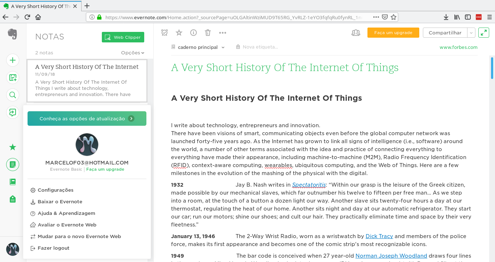
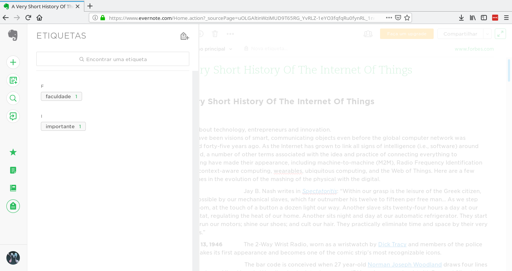

# Forward-From
|TÉCNICA DE ELICITAÇÃO|TIPO|REQUISITO|OBSERVAÇÕES|
|-----------|-----------|-------|------------|
**Rich Picture**|Funcional|Criar um novo caderno|[RP01](https://requisitos-2018-2-evernote.github.io/Evernote/Pre-Rastreabilidade/#visao-geral)|
||Funcional|Criar uma nota|[RP02](https://requisitos-2018-2-evernote.github.io/Evernote/Pre-Rastreabilidade/#visao-geral)|
||Funcional|Anexar arquivo na nota|[RP02](https://requisitos-2018-2-evernote.github.io/Evernote/Pre-Rastreabilidade/#visao-geral)|
||Funcional|Compartilhar nota|[RP02](https://requisitos-2018-2-evernote.github.io/Evernote/Pre-Rastreabilidade/#visao-geral)|
||Funcional|Adicionar lembrete à nota|[RP02](https://requisitos-2018-2-evernote.github.io/Evernote/Pre-Rastreabilidade/#visao-geral)|
||Funcional|Mover nota de caderno|[RP02](https://requisitos-2018-2-evernote.github.io/Evernote/Pre-Rastreabilidade/#visao-geral)|
||Funcional|Atualizar para conta premium|[RP02](https://requisitos-2018-2-evernote.github.io/Evernote/Pre-Rastreabilidade/#visao-geral)|
||Funcional|Baixar caderno|[RP02](https://requisitos-2018-2-evernote.github.io/Evernote/Pre-Rastreabilidade/#visao-geral)|
**Questionário**|Funcional|Sincronizar caderno|Questionário requisito 2|
**Story Board**|Funcional|Criar checklist dentro de uma nota|Criando Listas|
||Funcional|Editar nota|Uso diário|
**Brainstorming**|Funcional|O usuário deve visualizar as notas.|[BS01](https://requisitos-2018-2-evernote.github.io/Evernote/Elicitacao/#bs01)|
||Funcional|O usuário deve ser capaz de sincronizar os dispositivos.|[BS01](https://requisitos-2018-2-evernote.github.io/Evernote/Elicitacao/#bs01)|
||Funcional|O usuário deve ser capaz de editar um nota.|[BS01](https://requisitos-2018-2-evernote.github.io/Evernote/Elicitacao/#bs01)|
||Funcional|O usuário deve ser capaz de compartilha uma nota.|[BS01](https://requisitos-2018-2-evernote.github.io/Evernote/Elicitacao/#bs01)|
||Funcional|O usuário deve ser capaz de anexar arquivos do google drive em uma nota.|[BS01](https://requisitos-2018-2-evernote.github.io/Evernote/Elicitacao/#bs01)|
||Funcional|O usuário deve ser capaz de gravar áudio em uma nota.|[BS01](https://requisitos-2018-2-evernote.github.io/Evernote/Elicitacao/#bs01)|
||Funcional|O usuário deve ser capaz de tirar uma foto para uma nota.|[BS01](https://requisitos-2018-2-evernote.github.io/Evernote/Elicitacao/#bs01)|
||Funcional|O usuário deve ser capaz de inserir uma foto em uma nota.|[BS01](https://requisitos-2018-2-evernote.github.io/Evernote/Elicitacao/#bs01)|
||Funcional|O usuário deve ser capaz de esconder a barra de ferramentas.|[BS01](https://requisitos-2018-2-evernote.github.io/Evernote/Elicitacao/#bs01)|
||Funcional|O usuário deve ser capaz de duplicar uma nota.|[BS01](https://requisitos-2018-2-evernote.github.io/Evernote/Elicitacao/#bs01)|
**MoSCoW**|Não Funcional|Segurança dos dados|-
||Funcional|Excluir nota|MoSCoW requisito 8|
||Funcional|Renomear nota|MoSCoW requisito 12|
||Funcional|Alterar formatação do texto da nota|MoSCoW requisitos 18 - 25|
||Funcional|Criar lista enumerada|MoSCoW requisitos 28|
**Cenários**|Funcional|Restaurar nota|C11|
||Funcional|Ativar bloqueio de senha|C01|
||Funcional|Desativar o bloqueio de senha|C02|
||Funcional|Alterar o bloqueio de senha|C03|
||Funcional|Alterar tempo de bloqueio|C05|
**Casos de uso**|Funcional|Realizar login na aplicação|Criar lembrete|
||Funcional|Pesquisar notas dentro do caderno|Pesquisar nota|
||Funcional|Deletar permanentemente|Lixeira|
||Funcional|Cadastrar no app|Cadastro|
||Funcional|Cadastrar utilizando conta google|Cadastro|
**Product Backlog**|Funcional|Terminar sessão |US04|
||Funcional|Realizar login utilizando o Google|US05|
||Funcional|Gerenciar disposivos|US11|
||Funcional|Convidar amigos|US12|
||Funcional|Salvar nota|US20|
||Funcional|Pesquisar na nota|US23|
||Funcional|Ver estatísticas da nota|US25|
||Funcional|Renomear um caderno|US28|
||Funcional|Excluir o caderno|US29|
||Funcional|Ordenar cadernos por nome ou data|US30|
||Funcional|Classificar caderno por|US31|
||Funcional|Adicionar caderno à tela inicial do celular|US33|
||Funcional|Restaurar caderno apagado|US35|
**Introspecção**|Funcional|Compartilhar caderno|[IT01](https://requisitos-2018-2-evernote.github.io/Evernote/Elicitacao/#it01)|
||Funcional|O usuário deve visualizar as notas.|[IT01](https://requisitos-2018-2-evernote.github.io/Evernote/Elicitacao/#it01)|
||Funcional| O usuário deve ser capaz de sincronizar os disposivos.|[IT01](https://requisitos-2018-2-evernote.github.io/Evernote/Elicitacao/#it01)|
||Funcional|O usuário deve ser capaz de editar um nota.|[IT01](https://requisitos-2018-2-evernote.github.io/Evernote/Elicitacao/#it01)|
||Funcional|O usuário deve ser capaz de compartilha uma nota.|[IT01](https://requisitos-2018-2-evernote.github.io/Evernote/Elicitacao/#it01)|
||Funcional|O usuário deve ser capaz de “favorar” uma nota.|[IT01](https://requisitos-2018-2-evernote.github.io/Evernote/Elicitacao/#it01)|
||Funcional|O usuário deve ser capaz de inserir um lembrete em uma nota.|[IT01](https://requisitos-2018-2-evernote.github.io/Evernote/Elicitacao/#it01)|
||Funcional|O usuário deve ser capaz de imprimir uma nota.|[IT01](https://requisitos-2018-2-evernote.github.io/Evernote/Elicitacao/#it01)|
||Funcional|O usuário deve ser capaz de excluir uma nota.|[IT01](https://requisitos-2018-2-evernote.github.io/Evernote/Elicitacao/#it01)|
||Funcional|O usuário deve ser capaz de visualizar uma lixeira.|[IT01](https://requisitos-2018-2-evernote.github.io/Evernote/Elicitacao/#it01)|
||Funcional|O usuário deve visualizar a data de uma nota.|[IT01](https://requisitos-2018-2-evernote.github.io/Evernote/Elicitacao/#it01)|
||Funcional| O usuário pode visualizar o local de criação de uma nota.|[IT01](https://requisitos-2018-2-evernote.github.io/Evernote/Elicitacao/#it01)|
||Funcional| O usuário deve ser capaz de editar o titulo de uma nota.|[IT01](https://requisitos-2018-2-evernote.github.io/Evernote/Elicitacao/#it01)|
||Funcional| O usuário tem acesso a informações detalhas de uma nota.|[IT01](https://requisitos-2018-2-evernote.github.io/Evernote/Elicitacao/#it01)|
||Funcional|O usuário deve ser capaz de copiar uma nota inteira|[IT01](https://requisitos-2018-2-evernote.github.io/Evernote/Elicitacao/#it01)|
||Funcional|O usuário deve ser capaz de copiar um “link interno” de uma nota.|[IT01](https://requisitos-2018-2-evernote.github.io/Evernote/Elicitacao/#it01)|
||Funcional| O usuário pode visualizar a hora de criação de uma nota.|[IT01](https://requisitos-2018-2-evernote.github.io/Evernote/Elicitacao/#it01)|
||Funcional|O usuário pode personalizar a barra de ferramentas de uma nota.|[IT01](https://requisitos-2018-2-evernote.github.io/Evernote/Elicitacao/#it01)|
||Funcional|O usuário deve ser capaz de alterar a fonte do texto de uma nota.|[IT01](https://requisitos-2018-2-evernote.github.io/Evernote/Elicitacao/#it01)|
||Funcional|O usuário deve ser capaz de alterar o tamanho do texto de uma nota.|[IT01](https://requisitos-2018-2-evernote.github.io/Evernote/Elicitacao/#it01)|
||Funcional| O usuário deve ser capaz de alterar a cor do texto de uma nota.|[IT01](https://requisitos-2018-2-evernote.github.io/Evernote/Elicitacao/#it01)|
||Funcional|O usuário deve ser capaz de alterar o texto de uma nota para negrito.|[IT01](https://requisitos-2018-2-evernote.github.io/Evernote/Elicitacao/#it01)|
||Funcional|O usuário deve ser capaz de alterar o texto de uma nota para Itálico.|[IT01](https://requisitos-2018-2-evernote.github.io/Evernote/Elicitacao/#it01)|
||Funcional|O usuário deve ser capaz de alterar o texto de uma nota para sublinhado.|[IT01](https://requisitos-2018-2-evernote.github.io/Evernote/Elicitacao/#it01)|
||Funcional|O usuário deve ser capaz de alterar o texto de uma nota para traçado.|[IT01](https://requisitos-2018-2-evernote.github.io/Evernote/Elicitacao/#it01)|
||Funcional| O usuário deve ser capaz de marca o texto de uma nota|[IT01](https://requisitos-2018-2-evernote.github.io/Evernote/Elicitacao/#it01)|
||Funcional|O usuário deve ser capaz de inserir código-fonte em uma nota.|[IT01](https://requisitos-2018-2-evernote.github.io/Evernote/Elicitacao/#it01)|
||Funcional|O usuário deve ser capaz de inserir uma lista com marcadores no texto de uma|[IT01](https://requisitos-2018-2-evernote.github.io/Evernote/Elicitacao/#it01)|
||Funcional|O usuário deve ser capaz de inserir uma lista numerada no texto de uma nota.|[IT01](https://requisitos-2018-2-evernote.github.io/Evernote/Elicitacao/#it01)|
||Funcional|O usuário deve ser capaz de inserir uma caixa de seleção em uma nota.|[IT01](https://requisitos-2018-2-evernote.github.io/Evernote/Elicitacao/#it01)|
||Funcional|O usuário deve ser capaz de alinha o texto de uma nota.|[IT01](https://requisitos-2018-2-evernote.github.io/Evernote/Elicitacao/#it01)|
||Funcional| O usuário deve ser capaz de inserir uma tabela em uma nota.|[IT01](https://requisitos-2018-2-evernote.github.io/Evernote/Elicitacao/#it01)|
||Funcional|O usuário deve ser capaz de inserir uma linha em uma nota.|[IT01](https://requisitos-2018-2-evernote.github.io/Evernote/Elicitacao/#it01)|
||Funcional|O usuário deve ser capaz de anexar arquivos em uma nota.|[IT01](https://requisitos-2018-2-evernote.github.io/Evernote/Elicitacao/#it01)|
||Funcional|O usuário deve ser capaz de anexar arquivos do google drive em uma nota.|[IT01](https://requisitos-2018-2-evernote.github.io/Evernote/Elicitacao/#it01)|
||Funcional|O usuário deve ser capaz de gravar áudio em uma nota.|[IT01](https://requisitos-2018-2-evernote.github.io/Evernote/Elicitacao/#it01)|
||Funcional| O usuário deve ser capaz de tirar uma foto para uma nota.|[IT01](https://requisitos-2018-2-evernote.github.io/Evernote/Elicitacao/#it01)|
||Funcional|O usuário deve ser capaz de inserir uma foto em uma nota.|[IT01](https://requisitos-2018-2-evernote.github.io/Evernote/Elicitacao/#it01)|
||Funcional|O usuário deve ser capaz de esconder a barra de ferramentas.|[IT01](https://requisitos-2018-2-evernote.github.io/Evernote/Elicitacao/#it01)|
||Funcional| O usuário deve ser capaz de duplicar uma nota.|[IT01](https://requisitos-2018-2-evernote.github.io/Evernote/Elicitacao/#it01)|
||Funcional|O usuário deve ser capaz de alterar a data e hora da criação de uma nota|[IT01](https://requisitos-2018-2-evernote.github.io/Evernote/Elicitacao/#it01)|

|Aplicativo|US| Descrição|
|--|--|--|
|[IMG01](https://requisitos-2018-2-evernote.github.io/Evernote/Pos-Rastreabilidade/#img01)   [IMG02](https://requisitos-2018-2-evernote.github.io/Evernote/Pos-Rastreabilidade/#img02)|[US01](https://requisitos-2018-2-evernote.github.io/Evernote/Modelagem3/#us01-fazer-cadastro-no-aplicativo)|Fazer cadastro no aplicativo|
|[IMG01](https://requisitos-2018-2-evernote.github.io/Evernote/Pos-Rastreabilidade/#img01)   [IMG03](https://requisitos-2018-2-evernote.github.io/Evernote/Pos-Rastreabilidade/#img03) |[US02](https://requisitos-2018-2-evernote.github.io/Evernote/Modelagem3/#us02-fazer-cadastro-no-aplicativo-utilizando-os-dados-da-minha-conta-google)|Fazer cadastro utilizando os dados da minha conta Google|
|[IMG04](https://requisitos-2018-2-evernote.github.io/Evernote/Pos-Rastreabilidade/#img04)   [IMG05](https://requisitos-2018-2-evernote.github.io/Evernote/Pos-Rastreabilidade/#img05)   [IMG03](https://requisitos-2018-2-evernote.github.io/Evernote/Pos-Rastreabilidade/#img03)|[US03](https://requisitos-2018-2-evernote.github.io/Evernote/Modelagem3/#us03-realizar-login-na-aplicacao) |Realizar login na aplicação|
|[IMG06](https://requisitos-2018-2-evernote.github.io/Evernote/Pos-Rastreabilidade/#img06)  [IMG07](https://requisitos-2018-2-evernote.github.io/Evernote/Pos-Rastreabilidade/#img07) |[US04](https://requisitos-2018-2-evernote.github.io/Evernote/Modelagem3/#us04-terminar-sessao)|Terminar sessão |
|[IMG03](https://requisitos-2018-2-evernote.github.io/Evernote/Pos-Rastreabilidade/#img03)   [IMG06](https://requisitos-2018-2-evernote.github.io/Evernote/Pos-Rastreabilidade/#img06)|[US05](https://requisitos-2018-2-evernote.github.io/Evernote/Modelagem3/#us05-realizar-login-utilizando-o-google)|Realizar login utilizando o Google|
|[IMG09](https://requisitos-2018-2-evernote.github.io/Evernote/Pos-Rastreabilidade/#img09)|[US06](https://requisitos-2018-2-evernote.github.io/Evernote/Modelagem3/#us06-ativar-bloqueio-de-senha)|Ativar bloqueio de senha|
|[IMG10](https://requisitos-2018-2-evernote.github.io/Evernote/Pos-Rastreabilidade/#img10)|[US07](https://requisitos-2018-2-evernote.github.io/Evernote/Modelagem3/#us07-deativar-bloqueio-de-senha)|Desativar bloqueio de senha|
|[IMG11](https://requisitos-2018-2-evernote.github.io/Evernote/Pos-Rastreabilidade/#img11)|[US08](https://requisitos-2018-2-evernote.github.io/Evernote/Modelagem3/#us08-alterar-o-bloqueio-de-senha)|Alterar o bloqueio de senha|
|[IMG12](https://requisitos-2018-2-evernote.github.io/Evernote/Pos-Rastreabilidade/#img12)|[US09](https://requisitos-2018-2-evernote.github.io/Evernote/Modelagem3/#us09-alterar-tempo-de-bloqueio)|Alterar tempo de bloqueio|
|[IMG13](https://requisitos-2018-2-evernote.github.io/Evernote/Pos-Rastreabilidade/#img13)   [IMG14](https://requisitos-2018-2-evernote.github.io/Evernote/Pos-Rastreabilidade/#img14)|[US10](https://requisitos-2018-2-evernote.github.io/Evernote/Modelagem3/#us10-atualizar-para-conta-premium)|Atualizar para conta premium|
|[IMG15](https://requisitos-2018-2-evernote.github.io/Evernote/Pos-Rastreabilidade/#img15)   [IMG16](https://requisitos-2018-2-evernote.github.io/Evernote/Pos-Rastreabilidade/#img16)|[US11](https://requisitos-2018-2-evernote.github.io/Evernote/Modelagem3/#us11-gerenciar-dispositivos)|Gerenciar dispositivos|
|[IMG17](https://requisitos-2018-2-evernote.github.io/Evernote/Pos-Rastreabilidade/#img17)   [IMG18](https://requisitos-2018-2-evernote.github.io/Evernote/Pos-Rastreabilidade/#img18)|[US12](https://requisitos-2018-2-evernote.github.io/Evernote/Modelagem3/#us12-convidar-amigos)|Convidar amigos|
|[IMG19](https://requisitos-2018-2-evernote.github.io/Evernote/Pos-Rastreabilidade/#img19)   [IMG20](https://requisitos-2018-2-evernote.github.io/Evernote/Pos-Rastreabilidade/#img20)   [IMG21](https://requisitos-2018-2-evernote.github.io/Evernote/Pos-Rastreabilidade/#img21)|[US13](https://requisitos-2018-2-evernote.github.io/Evernote/Modelagem3/#us13-criar-nota)|Criar nota|
|[IMG22](https://requisitos-2018-2-evernote.github.io/Evernote/Pos-Rastreabilidade/#img22)   [IMG23](https://requisitos-2018-2-evernote.github.io/Evernote/Pos-Rastreabilidade/#img23)|[US14](https://requisitos-2018-2-evernote.github.io/Evernote/Modelagem3/#us14-editar-nota)|Editar nota|
|[IMG22](https://requisitos-2018-2-evernote.github.io/Evernote/Pos-Rastreabilidade/#img22)   [IMG23](https://requisitos-2018-2-evernote.github.io/Evernote/Pos-Rastreabilidade/#img23)|[US15](https://requisitos-2018-2-evernote.github.io/Evernote/Modelagem3/#us15-renomear-nota)|Renomear nota|
|[IMG24](https://requisitos-2018-2-evernote.github.io/Evernote/Pos-Rastreabilidade/#img24)   [IMG25](https://requisitos-2018-2-evernote.github.io/Evernote/Pos-Rastreabilidade/#img25)|[US16](https://requisitos-2018-2-evernote.github.io/Evernote/Modelagem3/#us16-excluir-nota)|Excluir nota|
|[IMG26](https://requisitos-2018-2-evernote.github.io/Evernote/Pos-Rastreabilidade/#img26)   [IMG27](https://requisitos-2018-2-evernote.github.io/Evernote/Pos-Rastreabilidade/#img27)|[US17](https://requisitos-2018-2-evernote.github.io/Evernote/Modelagem3/#us17-mover-nota-de-caderno)|Mover nota de caderno|
|[IMG29](https://requisitos-2018-2-evernote.github.io/Evernote/Pos-Rastreabilidade/#img29)   [IMG30](https://requisitos-2018-2-evernote.github.io/Evernote/Pos-Rastreabilidade/#img30)|[US18](https://requisitos-2018-2-evernote.github.io/Evernote/Modelagem3/#us18-restaurar-nota-de-caderno)|Restaurar nota de caderno|
|[IMG28](https://requisitos-2018-2-evernote.github.io/Evernote/Pos-Rastreabilidade/#img28 )|[US19](https://requisitos-2018-2-evernote.github.io/Evernote/Modelagem3/#us19-duplicar-nota)|Duplicar nota|
|[IMG19](https://requisitos-2018-2-evernote.github.io/Evernote/Pos-Rastreabilidade/#img19)   [IMG20](https://requisitos-2018-2-evernote.github.io/Evernote/Pos-Rastreabilidade/#img20)   [IMG21](https://requisitos-2018-2-evernote.github.io/Evernote/Pos-Rastreabilidade/#img21)   [IMG22](https://requisitos-2018-2-evernote.github.io/Evernote/Pos-Rastreabilidade/#img22)   [IMG23](https://requisitos-2018-2-evernote.github.io/Evernote/Pos-Rastreabilidade/#img23)|[US20](https://requisitos-2018-2-evernote.github.io/Evernote/Modelagem3/#us20-salvar-nota)|Salvar nota|
|[IMG31](https://requisitos-2018-2-evernote.github.io/Evernote/Pos-Rastreabilidade/#img31)   [IMG32](https://requisitos-2018-2-evernote.github.io/Evernote/Pos-Rastreabilidade/#img32)|[US21](https://requisitos-2018-2-evernote.github.io/Evernote/Modelagem3/#us21-alterar-formatacao-do-texto-da-nota)|Alterar formatação do texto da nota|
|[IMG33](https://requisitos-2018-2-evernote.github.io/Evernote/Pos-Rastreabilidade/#img33)   [IMG34](https://requisitos-2018-2-evernote.github.io/Evernote/Pos-Rastreabilidade/#img34)|[US22](https://requisitos-2018-2-evernote.github.io/Evernote/Modelagem3/#us22-anexar-arquivo-na-nota)|Anexar arquivo na nota|
|[IMG35](https://requisitos-2018-2-evernote.github.io/Evernote/Pos-Rastreabilidade/#img35)|[US23](https://requisitos-2018-2-evernote.github.io/Evernote/Modelagem3/#us23-pesquisar-na-nota)|Pesquisar na nota|
|[IMG36](https://requisitos-2018-2-evernote.github.io/Evernote/Pos-Rastreabilidade/#img36)   [IMG37](https://requisitos-2018-2-evernote.github.io/Evernote/Pos-Rastreabilidade/#img37)    [IMG38](https://requisitos-2018-2-evernote.github.io/Evernote/Pos-Rastreabilidade/#img38)    [IMG39](https://requisitos-2018-2-evernote.github.io/Evernote/Pos-Rastreabilidade/#img39)|[US24](https://requisitos-2018-2-evernote.github.io/Evernote/Modelagem3/#us24-compartilhar-nota)|Compartilhar nota|
|[IMG40](https://requisitos-2018-2-evernote.github.io/Evernote/Pos-Rastreabilidade/#img40)    [IMG41](https://requisitos-2018-2-evernote.github.io/Evernote/Pos-Rastreabilidade/#img41)|[US25](https://requisitos-2018-2-evernote.github.io/Evernote/Modelagem3/#us25-ver-estatísticas-da-nota)|Ver estatísticas da nota|
|[IMG42](https://requisitos-2018-2-evernote.github.io/Evernote/Pos-Rastreabilidade/#img42)    [IMG43](https://requisitos-2018-2-evernote.github.io/Evernote/Pos-Rastreabilidade/#img43)|[US26](https://requisitos-2018-2-evernote.github.io/Evernote/Modelagem3/#us26-criar-checklist-dentro-de-uma-nota)|Criar checklist dentro de uma nota|
|[IMG44](https://requisitos-2018-2-evernote.github.io/Evernote/Pos-Rastreabilidade/#img44)    [IMG45](https://requisitos-2018-2-evernote.github.io/Evernote/Pos-Rastreabilidade/#img45)|[US27](https://requisitos-2018-2-evernote.github.io/Evernote/Modelagem3/#us27-criar-um-novo-caderno)|Criar um novo caderno|
|[IMG46](https://requisitos-2018-2-evernote.github.io/Evernote/Pos-Rastreabilidade/#img46)|[US28](https://requisitos-2018-2-evernote.github.io/Evernote/Modelagem3/#us28-renomear-um-caderno)|Renomear um caderno|
|[IMG47](https://requisitos-2018-2-evernote.github.io/Evernote/Pos-Rastreabilidade/#img47)|[US29](https://requisitos-2018-2-evernote.github.io/Evernote/Modelagem3/#us29-excluir-o-caderno)|Excluir o caderno|
|[IMG48](https://requisitos-2018-2-evernote.github.io/Evernote/Pos-Rastreabilidade/#img48)|[US30](https://requisitos-2018-2-evernote.github.io/Evernote/Modelagem3/#us30-ordenar-cadernos-por-nome-ou-data)|Ordenar cadernos por nome ou data|
|[IMG49](https://requisitos-2018-2-evernote.github.io/Evernote/Pos-Rastreabilidade/#img49)|[US31](https://requisitos-2018-2-evernote.github.io/Evernote/Modelagem3/#us31-classificar-caderno)|Classificar caderno|
|[IMG50](https://requisitos-2018-2-evernote.github.io/Evernote/Pos-Rastreabilidade/#img50)|[US32](https://requisitos-2018-2-evernote.github.io/Evernote/Modelagem3/#us32-baixar-caderno)|Baixar caderno|
|[IMG](https://requisitos-2018-2-evernote.github.io/Evernote/Pos-Rastreabilidade/#img )|[US33](https://requisitos-2018-2-evernote.github.io/Evernote/Modelagem3/#us33-adicionar-caderno-a-tela-inicial-do-celular)|Adicionar caderno à tela inicial do celular|
|[IMG51](https://requisitos-2018-2-evernote.github.io/Evernote/Pos-Rastreabilidade/#img51)|[US34](https://requisitos-2018-2-evernote.github.io/Evernote/Modelagem3/#us34-sincronizar-caderno)|Sincronizar caderno|
|[IMG](https://requisitos-2018-2-evernote.github.io/Evernote/Pos-Rastreabilidade/#img )|[US35](https://requisitos-2018-2-evernote.github.io/Evernote/Modelagem3/#us35-restaurar-caderno-apagado)|Restaurar caderno apagado|
|[IMG52](https://requisitos-2018-2-evernote.github.io/Evernote/Pos-Rastreabilidade/#img52)|[US36](https://requisitos-2018-2-evernote.github.io/Evernote/Modelagem3/#us36-compartilhar-caderno)|Compartilhar caderno|
|[IMG54](https://requisitos-2018-2-evernote.github.io/Evernote/Pos-Rastreabilidade/#img54)   [IMG55](https://requisitos-2018-2-evernote.github.io/Evernote/Pos-Rastreabilidade/#img55)|[US37](https://requisitos-2018-2-evernote.github.io/Evernote/Modelagem3/#us37-pesquisar-notas-dentro-do-caderno)|Pesquisar notas dentro do caderno|
|[IMG53](https://requisitos-2018-2-evernote.github.io/Evernote/Pos-Rastreabilidade/#img53)|[US38](https://requisitos-2018-2-evernote.github.io/Evernote/Modelagem3/#us38-deletar-permanentemente)|Deletar permanentemente|

<!-- | App | Web | Rastros|
|--|--|--|
|  |  | |
|  |  | |
|  |  | |
|  |  | |
| |  | |
| |  | |
|    |  | |
|  |  | |
|  |  | |
|  |  | |
|  |  | |
|  |  | | -->

#### IMG01

#### IMG02

#### IMG03

#### IMG04

#### IMG05

#### IMG06

#### IMG07

#### IMG08

#### IMG09

#### IMG10

#### IMG11

#### IMG12

#### IMG13

#### IMG14

#### IMG15

#### IMG16

#### IMG17

#### IMG18

#### IMG19

#### IMG20

#### IMG21

#### IMG22

#### IMG23

#### IMG24

#### IMG25

#### IMG26

#### IMG27

#### IMG28

#### IMG29

#### IMG30

#### IMG31

#### IMG32

#### IMG33

#### IMG34

#### IMG35

#### IMG36

#### IMG37

#### IMG38

#### IMG39

#### IMG40

#### IMG41

#### IMG42

#### IMG43

#### IMG44

#### IMG45

#### IMG46

#### IMG47

#### IMG48

#### IMG49

#### IMG50

#### IMG51

#### IMG52

#### IMG53

#### IMG54

#### IMG55

